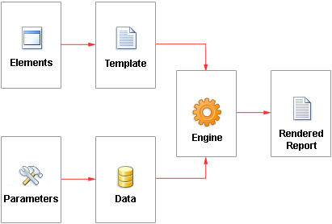
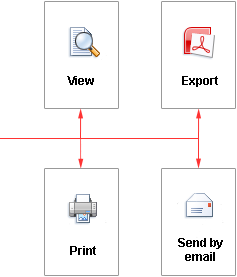

## Report

The report is a way of representing data in printed form and in a user-defined format. Any report, before rendering, serves as a report template. The report template is an element created by the report writer, following the rules set to designer for building a report. Elements refer to objects in the designer, while parameters are settings within the report designer. The picture below depicts a diagram illustrating the construction of the report.

