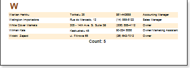

## KeepReportSummaryTogether Property

When printing, sometimes the last data row will be on one page and the report summary on the next one. The report will not look good.

To avoid such unpleasant incidents the **Report Summary** **band** has the **KeepReportSummaryTogether** property.

If the **KeepReportSummaryTogether** property is set to **true**, then minimum one data row will be printed with the report summary. Thus it is necessary to take into account that after the data row is transferred free space may remain on a fist page. Therefore, one should take this into account when working with this property.

The default value of the property is set to **true**.
