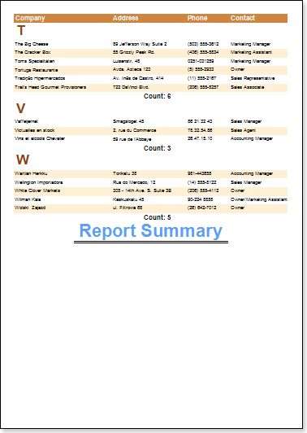
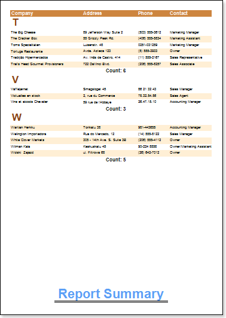

## Print At Bottom Property

Suppose there is a report in which data covers only one-third of the last page. The report summary is displayed after the data.

But it is necessary that the report summary should be placed on the bottom of the page. The Report Summary band has the PrintAtBottom property. By default, the property is set to false.

If the PrintAtBottom property is set to true, then summary will be output on the bottom of the page.

