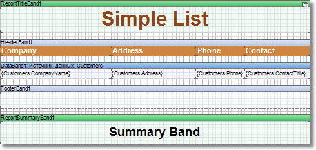

## Report Summary band

The report summary can be shown using the **ReportSummary** band. There are no limits on how many **ReportSummary** bands can be placed on a template page. If the report template has multiple pages, the **ReportSummary** band can be placed on each page. In that case, it will appear after each completed template page.

This band is used to output report summary.

On the picture above shows how bands can be placed on a page.  Here one can see the top-down order of bands:

 The Report Title band;

 The Header band;

 The Data band;

 The Footer band;

 The Report Summary band.
