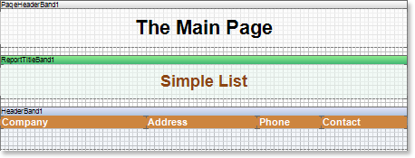

## Report Title band

One of the ways to display the report header is the way of using the Report Title band. The report header will be output only once in the beginning of a report. The Report Title band is placed after the Page Header band, and before the Header band. The number of Report Title bands on a page is unlimited.

On the picture above shows how bands can be placed on a page. Here one can see top-down the Page Header, Report Title, and Header bands.
