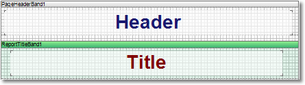
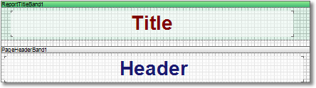

## ReportTitleBand Property

By default, the **Page Header** band is placed above the **Report Title** band:

but it is also possible to output the **Report Title** band before the **Page Header** band:

By default this property is set to **false**. Set the **TitleBeforeHeader** property to **true** and the **Report Title** band will be output before the **Page Header** band.
