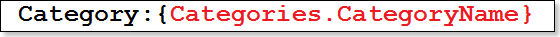

## Expressions In Rich Text

The RTF text is an expression in the **RichText** component. There are no significant differences between working with expressions in the **RichText** component and other text components.

The syntax and use of expressions is similar to the syntax and use of expressions in text components, but there is one particular issue to consider - any applied formatting must be applied to the full code insertion and not just part of it.

Suppose that you want the calculated value in the RTF text to be a specific color.  It is vital that the color attribute is applied to the full expression from the opening brace "{" to the closing brace "}" including those symbols. For example:

* Formatting is fully applied to the expression. This expression will work correctly.

* Formatting is applied to only part of the expression. This expression will not work.

* Formatting is fully applied to the expression, but the braces are not included. This expression will not work.

* Formatting does not include the opening brace. This expression will not work.

You should know that in the expressions of the RichText component only plain text can be inserted this way (without formatting commands). So it is not possible to insert the RTF text. You can only assign all of its properties with help of the DataColumn.

* The property **Full Convert Expression** provides the ability to handle expressions in the RTF component in different ways. If this property is set to **false**, then the expression will be processed quickly, simply and consistently. If this property is set to **true**, then processing of expressions in the RTF component will be more thorough. This method slows report rendering, but allows converting expressions more thoroughly. Especially if the expression uses characters other than the numbers and Latin alphabet.
