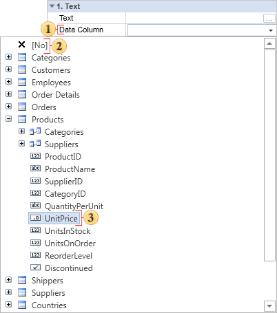

## Loading Rich Text From Data Field

The **RichText** component can load the RTF text from the data field using the **DataColumn** property. To load the RTF text simply select a field from the data dictionary tree. When rendering the report generator will automatically load the RTF text for you.

 **The** **DataColumn** **property.** This property is used to indicate from which data field the RTF text should be loaded. Click the button beside to select the relevant column.

 **Null node.** Selecting this node means that the RTF text is not loaded from a data field.

 **Selected** **field.** The Data field from which the RTF text will be loaded.
