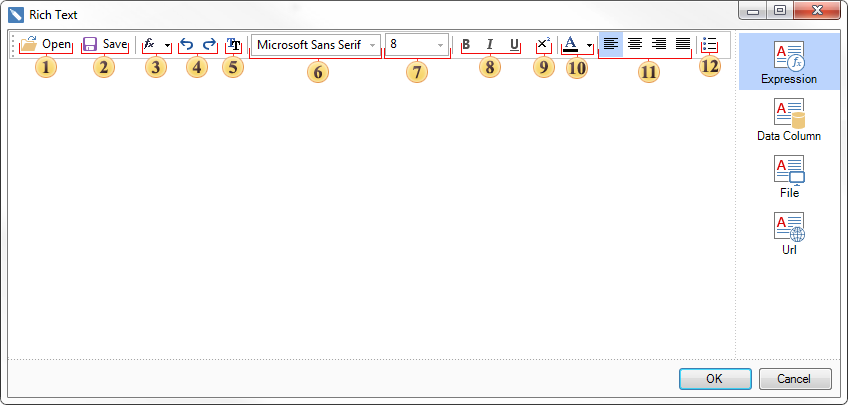

## Rich Text Editor

The **RichText** component has a special editor. This editor can load and save the **RTF** text, change the font, size, color, paste expressions etc. With this editor you can edit the RTF text without using third-party editors. The editor is called by double-clicking on the RichText component. This editor contains the following tabs:

  * **Expression**. Specify here some text. You can edit the text here using a set of special tools.

  * **Data Column**. Specify the data column that contains the Rich text.

  * **File**. Load a file that contains the Rich text.

  * **Url**. Specify the URL the source with the Rich text.

The picture below shows the **Rich** text editor with **Expression** tab open:

 The **Open** button. Opens the dialog to load the saved *.rtf file.

 The **Save** button. Opens the dialog to save the text as *.rtf.

 The **Insert** button. Shows the data dictionary tree.

 The **Undo** and **Redo** buttons.

 The **Font** button Calls the window to setup the font.

 Font face field. This field displays the current type of the font name. Also, this field contains a drop-down list of values that provides the ability to change the font type without calling the font settings dialog box.

 Font size field. This field displays the font size value. Also, this field contains a drop-down list of values that provides the ability to change the font size without callingthe font settings window.

 **Bold**, **Italic**, **Underline** buttons.

 The **Superscript** button. It provides the ability to place text on top with respect to the previous one. For example, the exponents.

 The **Color** button. Calls the menu to change the text color.

 Alignment of text: **Align Left**, **Align Center**, **Align Right**, **Justify**.

 The **Bullets** button. Enables bullets in text.
