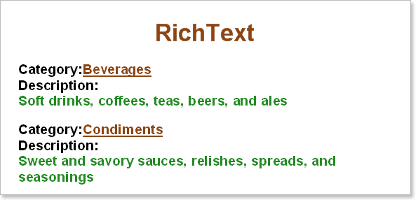

## Rich Text

Stimulsoft Reports allows users to include **Rich Text** formatted (**RTF**) text in reports, without any limitations.

The **RichText** component is designed for working with rich text, and can automatically change its size depending on the size of the **RTF** text within it.  It can process expressions, and supports a wide variety of styles, processing at the end of report rendering, etc.

