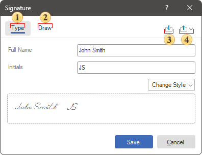
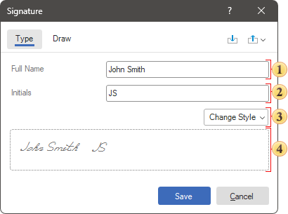
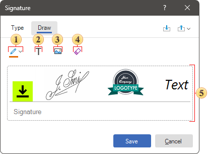

## Electronic Signature

This component is used to graphically sign a report. The following can be used as an electronic signature:

* Drawing initials and full name with different styles;

* Signature style, text, image, or their combinations.

Electronic signature settings can be found in the component editor and using the [component properties](#tableofproperties). To call the editor:

* Double click on the Electronic Signature component;

* Select the Signature component and select the Design command from the context menu.

The general algorithm for adding a signature is as follows:

* Call the editor;

* Define the signature parameters in the [Type](#type) or [Draw](#draw) tab;

* Click the Save button in the component editor. The Sign command will be instead of the Save command if the report will be signing in the viewer.

**Sign of the report**

When adding the Electronic Signature component to a report, you can change the signature when viewing the report. To do this, go to the viewer, load a report with a signature and select the Sign command on the viewer toolbar. If the report uses several Electronic Signature components, they should be edited separately. To do this, call the component editor using the Sign command and use the Next and Back buttons to move between the signed components.

> **Information**
>
> Please note that if the Sign command is not displayed on the viewer toolbar, then it should be enabled in the report template [preview settings](../../Reports_Designer/Template/Preview_Settings.md).

The Sign command will become unavailable on the toolbar after a report has be signed in the viewer. The report can only be verified once.
Report re-sign in the viewer

You can set the Allow Clear Signature property of the component to True in the report designer if you would to have the ability for removing report signature in the viewer. After that, you can remove report signature in the viewer using Clear Signature command from the context menu.

Component Editor

Each electronic signature mode is presented on a separate tab and contains specific settings. In addition, the component editor has control elements - save signature and list of signatures.

 Signature in the Type mode provides the ability to specify the full name and initials that will be displayed in the component, as well as specify the style of their outline.

 Signature in the Draw mode provides the ability to use an image, text, signature style, or their combinations.

 The Save command provides the ability to add a signature to the list of saved signatures.

 A menu that contains a list of previously saved signatures. When hovering over an item in the list of saved labels, the Delete control will also be displayed clicking on which, the signature will be removed from the list.

Electronic signature parameters of the Type mode

In this mode, you can specify the full spelling of the name and initials, and then determine the writing style.

 A field in which you can specify the full name.

 A field in which you can specify initials.

 A menu that contains a list of styles for displaying the signature.

 The field in which the thumbnail of the signature is displayed.

In order to draw a signature, you should do the following in the component editor in the Type tab:

* Enter a value in the Full Name and/or Initials fields;

* Click the Change style;

* Select a font for drawing the signature.

Electronic signature parameters in the Draw mode

In this mode, you can draw a signature, specify its text, image, or combine these methods.

 The Use Brush command provides the ability to select a brush to draw the signature.

 The Insert Text command provides the ability to insert formatted text into a signature.

 The Insert Image command provides the ability to upload an image for the signature background.

 Signature cleanup command.

 The field in which the thumbnail of the signature is displayed.

> **Information**
>
> Please note that the signature sketch field contains a horizontal line as a separator. Everything above this line is the signature area. Everything below is the description area, which can be changed using the Description properties. Also, an icon is displayed in the signature area. It displays the state of the signature. If the icon is displayed, the final signing of the report has not been completed when viewing it. To determine the status of the icon display, as well as its configuration, you may use the properties of the component.

Adding a signature in the Draw mode

Do the next steps to draw a signature, in the component editor, in the Draw tab:

* Select a brush color by clicking the down arrow control next to Use Brush;

* Click on Use Brush;

* In the area of the signature thumbnail, hold down the left button of the mouse;

* Draw a signature keeping the button pressed.

* After that, if necessary, add an image and text to the signature.

**Table of properties**

See below a list of properties of the Electronic Signature component.

| Name | Description |
| --- | --- |
| Allow Clean Signature | Allows to clear a signature in the viewer. |
| Mode | Changes the component mode - Type or Draw. |
| Type | A group of properties available only in the Type signature mode, which allows you to change the following settings: The Full Name property changes the text of the full name in the signature; The Initials property provides changes the text of the initials in the signature; The Style property changes the style to display the full name and initials in the signature. |
| Draw | A group of properties available only in the Draw signature mode and allows you to change the following settings: The Aspect Ratio property maintains the proportions of the drawn signature when it is stretched, in cases where the size of the component in the report is changed; The Horizontal Alignment property changes the alignment of the drawn signature area in the component horizontally; The Vertical Alignment property changes the alignment of the drawn signature area in the component vertically; The Stretch property stretches the area of the drawn signature to the area of the component in the report. |
| Image | A group of properties available only in the Draw signature mode, which allows you to change the following image settings: The Image property calls the editor with which you can upload an image for a signature; The Aspect Ratio property maintains the aspect ratio of the image when it is stretched, in cases where the component is resized in the report; The Horizontal Alignment changes the horizontal alignment of the signature image in the component; The Vertical Alignment property changes the vertical alignment of the signature image in the component; The Stretch property stretches the signature image over the component area in the report. |
| Text | A group of properties available only in the Draw signature mode, which allows you to change the following text settings: The Text changes the text for the signature; The Horizontal Alignment property changes the horizontal alignment of the signature text in the component; The Font property group changes the font settings, such as font family, size, style, etc., for the signature text; The Color property changes the color for the signature text. |
| Icon | A group of properties for setting signature icon. |
| Description | A group of properties for setting signature description. |
| Left | Defines the left padding of the component of the report page borders. The value is defined in the units of the report. |
| Top | Defines the indent of the component from the top of the report page borders. The value is defined in the units of the report. |
| Width | Defines the width of a component in a report. The value is defined in the units of the report. |
| Height | Defines the height of a component in a report. The value is defined in the units of the report. |
| Min Size | A group of properties that defines the minimum width and height of a component in a report. The value is defined in the units of the report. |
| Max Size | Defines the maximum width and height of a component in a report. The value is defined in the units of the report. |
| Margins | Customizes the display of the component's borders. You can define the sides that will be displayed, the color of the borders, the thickness and style, as well as the shadow of the component. |
| Brush | Defines the brush type, color, and other brush options for the background of a component in a report. |
| Conditions | Calls the conditional formatting editor of reports. |
| Component Style | Selects the style that will be applied to the component in the report. |
| Use Parent Styles | Uses the style of the report component to which the current component belongs. |
| Anchor | Specifies how the current component's position will snap to the parent component's dimensions. |
| Can Grow | Automatically increases the height of a component. |
| Can Shrink | Automatically reduces the height of a component. |
| Dock Style | Sets the docking mode of the current component with others. |
| Enabled | Enables or disables processing of the current component when rendering a report. |
| Grow to Height | Automatically changes the height of the current component, depending on the height of the parent component. |
| Interaction | Defines interaction settings for the current component when viewing a report. |
| Printable | Defines the behavior of the component when printing - whether to print it or not. |
| Print On | Determines the print mode of a component. |
| Shift Mode | Determines the offset mode of a component, depending on the behavior of the above component. |
| Name | Changes the name of the current component. |
| Alias | Changes the alias of the current component. |
| Restrictions | Configures the permissions for using the current component: The **Allow Change** option enables or disables changes of the component. If checked, the current item can be changed. The **Allow Delete** option enables or disables the deletion of a component. The **Allow Move** option allows or prohibits moving a component. The **Allow Resize** option enables or disables resizing of a component. The **Allow Select** option enables or disables the component selection. |
| Locked | Enables or disables resizing and moving the current component. If the property is set to True, then the current component cannot be moved or resized. If this property is set to False, then this component can be moved and resized. |
| Linked | Binds the current location to a report page or other component. If the property is set to True, then the current component is linked to the current location. If this property is set to False, then this component is not linked to the current location. |
