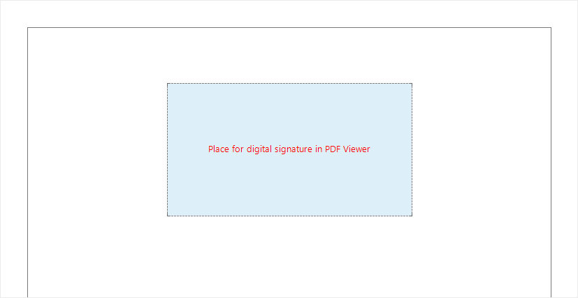

## PDF Digital Signature

The PDF Digital Signature component is an area in a report where, after the report has been converted to PDF, a digital signature can be placed. This component can be placed anywhere. After exporting the report to PDF, in Acrobat Reader, click on this component and follow the instructions - create or load a certificate to sign the document.

**Table of Properties**

See below the list of properties of the PDF Digital Signature component.

Name

Description

Placeholder

Defines a placeholder for the PDF Digital Signature component.

Left

Defines the left padding of the component of the report page borders. The value is defined in the units of the report.

Top

Defines the indent of the component from the top of the report page borders. The value is defined in the units of the report.

Width

Defines the width of a component in a report. The value is defined in the units of the report.

Height

Defines the height of a component in a report. The value is defined in the units of the report.

Min Size

A group of properties that defines the minimum width and height of a component in a report. The value is defined in the units of the report.

Max Size

Defines the maximum width and height of a component in a report. The value is defined in the units of the report.

Margins

Customizes the display of the component's borders. You can define the sides that will be displayed, the color of the borders, the thickness and style, as well as the shadow of the component.

Brush

Defines the brush type, color, and other brush options for the background of a component in a report.

Conditions

Calls the conditional formatting editor of reports.

Component Style

Selects the style that will be applied to the component in the report.

Use Parent Styles

Uses the style of the report component to which the current component belongs.

Anchor

Specifies how the current component's position will snap to the parent component's dimensions.

Can Grow

Automatically increases the height of a component.

Can Shrink

Automatically reduces the height of a component.

Dock Style

Sets the docking mode of the current component with others.

Enabled

Enables or disables processing of the current component when rendering a report.

Grow to Height

Automatically changes the height of the current component, depending on the height of the parent component.

Interaction

Defines interaction settings for the current component when viewing a report.

Printable

Defines the behavior of the component when printing - whether to print it or not.

Print On

Determines the print mode of a component.

Shift Mode

Determines the offset mode of a component, depending on the behavior of the above component.

Name

Changes the name of the current component.

Alias

Changes the alias of the current component.

Restrictions

Configures the permissions for using the current component:

The **Allow Change** option enables or disables changes of the component. If checked, the current item can be changed.

The **Allow Delete** option enables or disables the deletion of a component.

The **Allow Move** option allows or prohibits moving a component.

The **Allow Resize** option enables or disables resizing of a component.

The **Allow Select** option enables or disables the component selection.

Locked

Enables or disables resizing and moving the current component. If the property is set to True, then the current component cannot be moved or resized. If this property is set to False, then this component can be moved and resized.

Linked

Binds the current location to a report page or other component. If the property is set to True, then the current component is linked to the current location. If this property is set to False, then this component is not linked to the current location.
