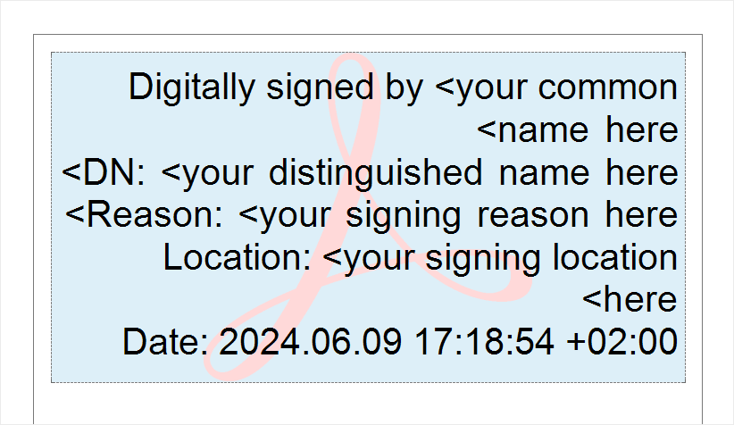
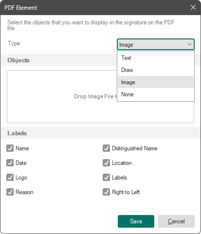

## PDF Element

The PDF Element is a component that, when exporting a report to a PDF file, places a standard digital signature for the PDF document at its location. The signature is applied using a certificate, which must be selected in the export settings.

> **Information**
>
> In the export settings menu, the certificate can only be selected from the Windows certificate store using the system UI. When exporting via code, you can still use the UI, but it’s also possible to search for a certificate by its *SubjectNameString* or pass the certificate directly to the export process as a byte array using StiPdfExportSettings.

If no certificate is specified, the component functions as a PDF Digital Signature, adding an interactive element for signing with Adobe Acrobat tools.

Stimulsoft's export to the PDF format supports signing a document with only one certificate. Therefore, if the report contains more than one PDF Element component, only the first one will be considered the signature field for the certificate. All other components will function as PDF Digital Signature, providing an interactive signing element for Adobe Acrobat.

Configuration of the PDF Element is performed through:

* The component editor, where the type of signature and its parameters can be selected;

* The properties list of this component.

To open the editor:
* Double-click on the PDF Element component;
* Select the PDF Element component and choose the Design command from the context menu.

Component Editor

The editor contains the signature type selector Type and a group of Labels parameters, which determine what information from the certificate will be added to the PDF document's digital signature. Additionally, depending on the type of signature, an optional Objects field may be available.

* The Objects field is available only if the signature type is set to Image or Draw.

* If the type is Image, the Objects field allows you to upload an image using the Open control or delete it using the Remove command.

* If the type is Draw, the Objects field lets you draw a signature. To draw, press and hold the left mouse button and create the graphical signature.

* The Labels group contains parameters that determine what information from the certificate will be added to the digital signature. If a parameter checkbox is selected, the corresponding information from the certificate will be added to the digital signature. If no parameters are selected, no textual information will be added to the signature.

Properties Table

The table provides a list of the components properties.

| Name | Description |
| --- | --- |
| Appearance | Provides the ability to set the type of the element: None, Text, Draw, or Image. |
| Right to Left | Allows enabling the Right-to-Left mode for the component. If the property is set to True, the Right-to-Left mode will be applied to this component when building the report. If set to False, the Left-to-Right mode will be used. |
| Left | Enables specifying the left margin of the component from the report page boundaries. The value is defined in the report's measurement units. |
| Top | Enables specifying the top margin of the component from the report page boundaries. The value is defined in the report's measurement units. |
| Width | Allows defining the width of the component in the report. The value is defined in the report's measurement units. |
| Height | Allows defining the height of the component in the report. The value is defined in the report's measurement units. |
| Min Size | A property group that allows setting the minimum width and height of the component in the report. The value is defined in the report's measurement units. |
| Max Size | A property group that allows setting the maximum width and height of the component in the report. The value is defined in the report's measurement units. |
| Border | A property group that allows configuring the borders of the component, including specifying which sides are displayed, the border color, thickness, style, and shadow. |
| Brush | A property group that allows defining the brush type, color, and other brush parameters for the component's background in the report. |
| Conditions | Provides access to the conditional formatting editor for the report. |
| Component Style | Allows selecting a style to be applied to the component in the report. |
| Use Parent Styles | Enables using the report component's style that the current component belongs to. |
| Anchor | Allows defining the anchoring mode of the current component to the dimensions of its parent component. |
| Can Grow | Allows automatically increasing the height of the component. |
| Can Shrink | Allows automatically decreasing the height of the component. |
| Dock Style | Enables setting the docking mode for the current component relative to others. |
| Enabled | Allows enabling or disabling the processing of the current component during report building. |
| Grow to Height | Allows automatically changing the height of the current component based on the height of its parent component. |
| Interaction | Enables defining interactive settings for the current component when viewing the report. |
| Printable | Allows specifying whether the component will be printed or not. |
| Print On | Provides the ability to define the printing mode of the component. |
| Shift Mode | Allows setting the component's offset mode based on the behavior of the component above it. |
| Name | Enables changing the name of the current component. |
| Alias | Allows changing the alias of the current component. |
| Restrictions | Provides the ability to configure the usage permissions for the current component: The Allow Change parameter allows enabling or disabling the ability to modify the component. If checked, the component can be changed. If unchecked, it can't be modified. The Allow Delete parameter allows enabling or disabling the ability to delete the component. If checked, the component can be deleted. If unchecked, it can't be deleted. The Allow Move parameter allows enabling or disabling the ability to move the component. If checked, the component can be moved. If unchecked, it can’t be moved. The Allow Resize parameter allows enabling or disabling the ability to resize the component. If the checkbox is selected, the size of the current component can be changed. If it isn’t selected, the size of the component can’t be modified. The Allow Select parameter allows enabling or disabling the ability to select the component. If the checkbox is selected, the current component can be chosen. If it isn’t selected, the component can’t be selected. |
| Locked | Provides the ability to prohibit or allow resizing and moving the current component. If the property is set to True, the component can’t be moved or resized. If set to False, the component can be moved and resized. |
| Linked | Provides the ability to bind the current location to the report page or another component. If the property is set to True, the component is locked to its current location. If set to False, the component isn’t locked to its current location. |
