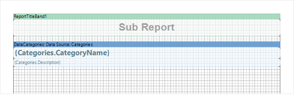
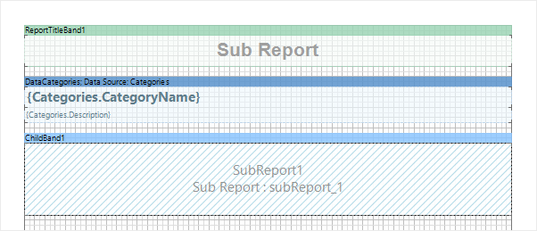
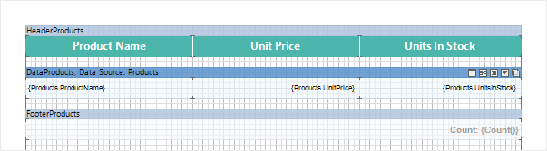
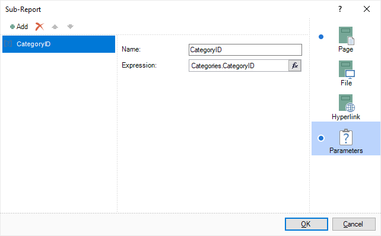
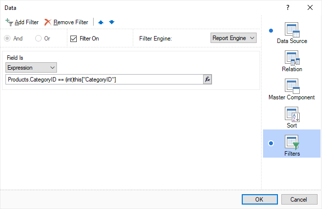
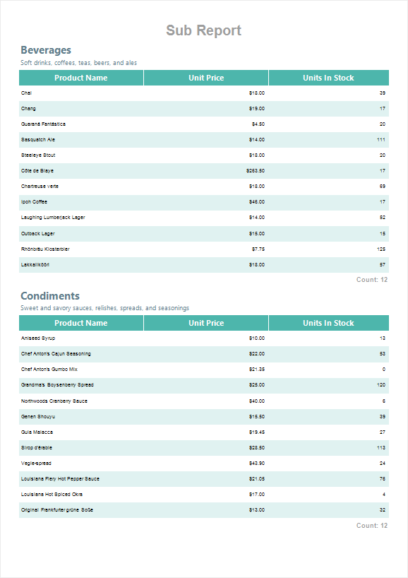

## Report sample with parameters

Let's create a report with products by category. The list of categories will be located in the main report, and the list of products will be located in the sub-report (on another page in the same report template).

**Step 1**: Open the report designer;

**Step 2**: Connect the data;

**Step 3**: Add the **ReportTitleBand**, if required;

**Step 4**: Add a **Data** Band with a list of categories;

**Step 5**: Add the **Child** band;

**Step 6**: Place the **Sub-Report** component on this band. At the same time, the new page **subReport_1** will be added to the report template;

**Step 7**: Go to the new page of the report template and place a band with the list of products, titles and totals, if required;

> **Information**
>
> If you go to the **Preview**, then, for each category, the entire list of products will be displayed without considering to which category the products belong to. To display only products which belong to the category, you should add a parameter with category keys and transfer them to the sub-report.

**Step 8**: Go back to the page with the list of categories;

**Step 9**: Call the editor of the sub-report and go to the **Parameters** tab;

**Step 10**: Add a new parameter, specify a name and column **Categories.CategoryID** as an expression;

**Step 11**: Go back to the products page and specify the filter expression using this parameter **Products.CategoryID == (int)this["CategoryID"]**;

**Step 12**: Go to the Preview. A list of products will be displayed by categories.

