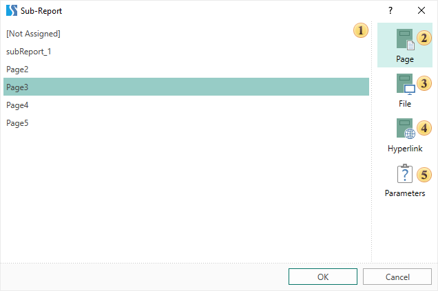
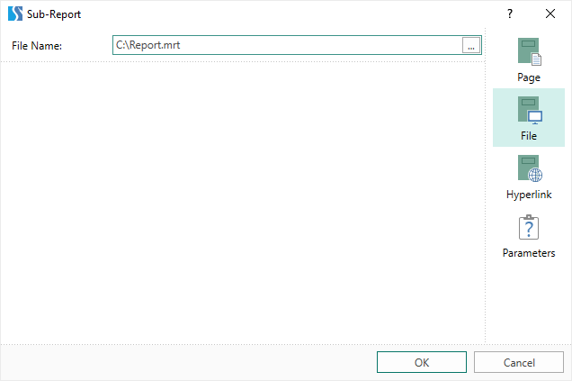
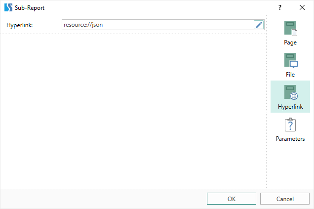
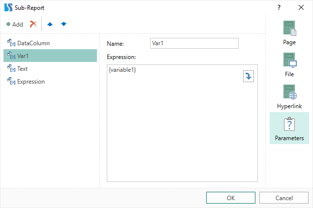

## Editor

In the editor, you can specify the resource for the **Sub-Report** component and configure the settings.

To call the editor, double-click the **Sub-Report** component on the report page:

 Settings panel. If the **Page** tab is selected, the list of report template pages will be displayed on this panel. Any of these pages can be a resource for the component and, when rendering the report, it will be displayed on this component.

 The **Page** tab. In this tab, you can select the report template page that will be the resource for the **Sub-Report** component.

 The **File** tab. In this tab, you can specify a path to the file (external report) that will be the resource for the **Sub-Report** component.

 The **Hyperlink** tab. In this tab, you can specify a link to the external report or to the resource that will be the resource for the **Sub-Report** component.

 The **Parameters** tab. In this tab you can add and configure the settings that will be passed to the sub-report.

Parameters are usually used to filter data or transfer information from the main report to a sub-report. To add a parameter, you should:

* Call the editor of the sub-report;

* Go to the **Parameters** tab;

* Click the **Add** **button**;

* Specify the name of the parameter and its expression.

In the parameter expression, you can specify:

* The data column;

* Variable;

* Any other expression.

After that, you should go to the resource of the **Sub-Report** component (a page or another report) and specify this parameter, for example, in the filter expression.
