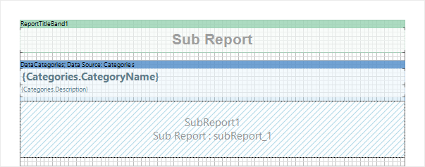
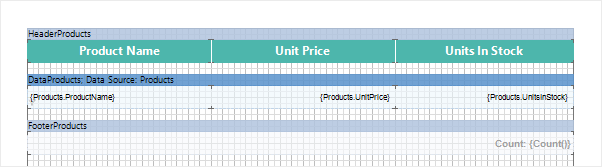
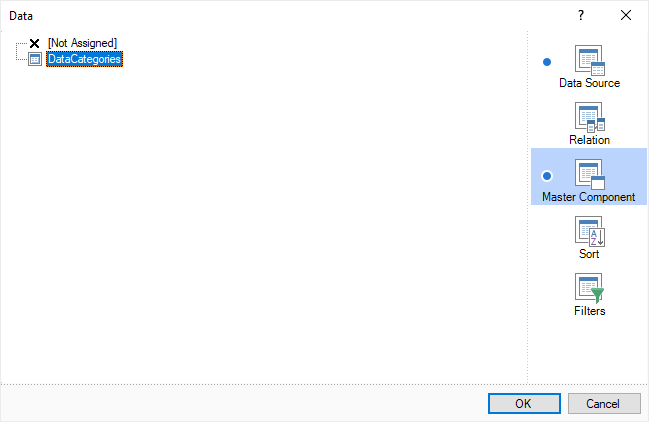

## Master-Detail Reports and Sub-Reports

You can build a Master-Detail report using the Sub-Report component in several ways:

* [Pass parameters](Creating_Report_with_SubReport_and_Parameters.md) from Master entries to Detail by filtering data;

* Using the Master Component property in the Data band.

It is possible to design the Master-Detail report using the Sub-Report component. Put DataBand1 on a page of a report template. Insert Sub-Report component into this band. Put DataBand2 on the sub-report page. The picture below shows the report template:

In this example the DataBand1 can be defined as the Master for the DataBand2 that is placed in the sub-report page of a report. For this you need to choose the Master component in the data settings. The picture below shows the sample of the Data Setup window:

As you can see, the DataBand1, that is placed on the report page, is the Master in the Master-Detail report. If several DataBands are placed on the sub-report page then, when creating the Master-Detail report, the Master is either the DataBand in what the Sub-Report is placed or any other DataBand, placed in the sub-report page.
