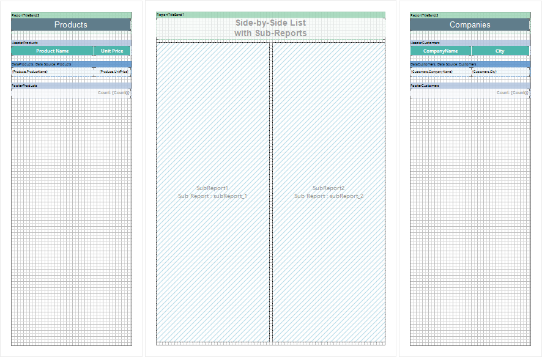
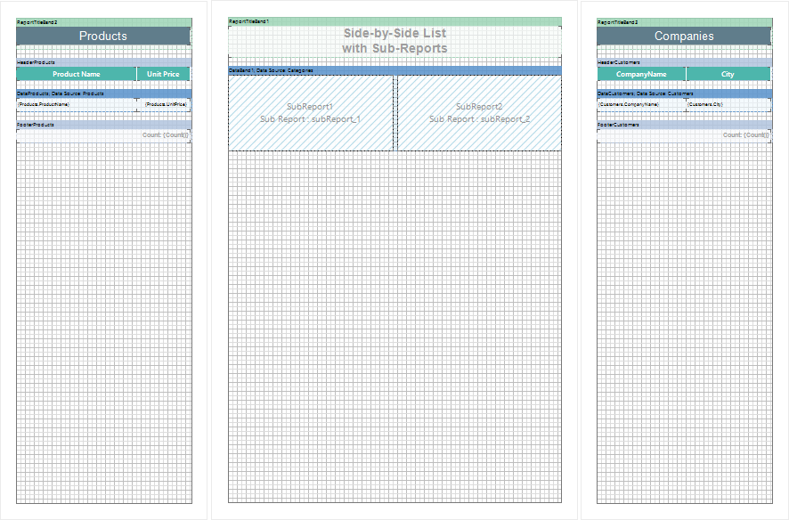

## Side-by-Side Reports and Sub-Reports

You can use the **Sub-Report** component to create the **Side-by-side** report. The **Side-by-side** report consists of independent lists of data, located side by side. The picture below shows an example of a **Side-by-side** report template with the location of the **Sub-Report** component on on a page of the report template:

As you can see on the picture above, when rendering a report, independent data lists will be displayed, two **Side-by-side** sub-reports will be built. Thus it is possible to build more complex reports: for example, put three **Sub-Report** components together side by side, and then, when rendering a report, three independent data lists, three **Side-by-side** sub-reports will be output.

You should also remember that the **Sub-Report** can be placed in the **DataBand**. Accordingly, put two or more **Sub-Report** components to build **Side-by-side** reports in one **DataBand**. The picture below shows an example of the **Side-by-side** report templates with the location of the **Sub-Report** component in the **DataBand**:

