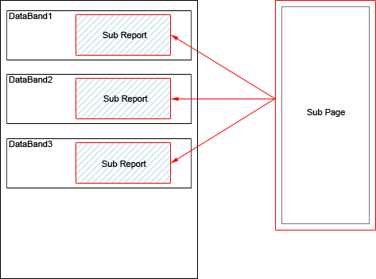

## Sub-Reports on Data Band

The Sub-Report component can be placed on the DataBand. When rendering a report, the Sub-Report will be rendered as the item of the DataBand, so this component will be printed in each DataBand. The picture below shows the scheme of rendering of the sub-report when placing the Sub-Report component in the DataBand:

In this case the height of the component on the sub-report page of a report will be higher than the height of the Sub-Report component. So the Sub Report component is placed in the DataBand and rendered as the item of the DataBand, and, in this case, the CanGrow property works and the component can grow by height.
