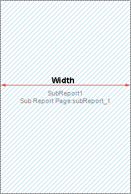
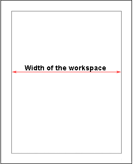
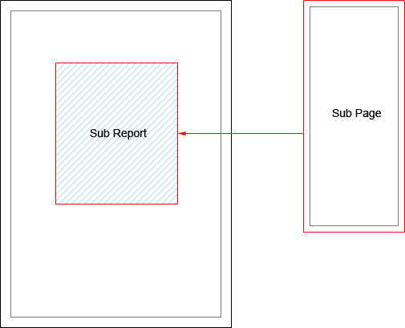

## Sub-Reports on Page

The **Sub-Report** component can be placed on any part of a page. The width of the nested page depends on the width of the **Sub-Report** component. The picture below shows a sample of the **Sub-Report** component and nested page:

The **CanGrow** property of the **Sub-Report** component is always set to **true** but, when placing this component, it cannot be grown by height. So you should take into the account the height of the component on the nested page: it should not be higher than the **Sub-Report** component. When rendering a report, the **Sub-Report** component, placed on the report template, will be rendered as the report page item. When rendering a report, the reporting tool will render all sub-reports and place them in the container of the **Sub-Report** component. The picture below shows a sample of placing the nested page in a report:

