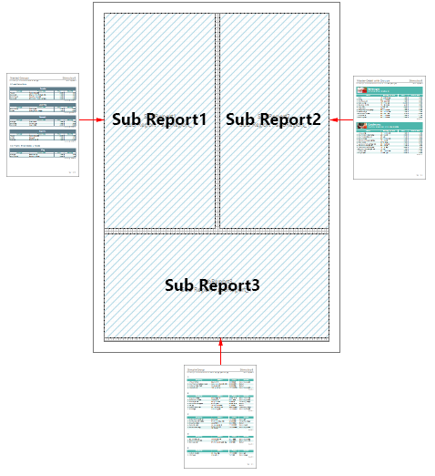

## Sub-Reports

The Sub-Report component is used to display another report in the current report. In this case, the sub-report will be displayed in the current report only within the Sub-Report component. In other words, when you render a report with Sub-Report components, the report engine will build all the nested reports and place them in these components.

You can place sub-reports on:

* [Bands](Sub-Reports_on_Data_Band.md);

* [Pages](Sub-Reports_on_Page.md);

* Panels;

* Any other components of the report that can be containers for sub-reports.

A report that will be displayed in the rendered report using the Sub-Report component can be obtained:

* From another page in the report template;

* From the file (*.mrt, *.mrz, *.mdc, *.mdz);

* By the hyperlink (*.mrt, *.mrz, *.mdc, *.mdz);

* From the report resources (*.mrt, *.mrz, *.mdc, *.mdz).

> **Information**
>
> You may place the Sub-Report component on another sub-report. So, the number of levels of nested reports is unlimited.

You can add sub-reports by:

* Selecting this component in the Components group in the Toolbox or in the Insert tab. In this case, a new page which is associated with this component will be automatically created in the report.

* Dragging the report from the resources to the report. In this case, a new page will not be created, and in the Sub-Report component, a link to the resource will be generated.
