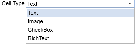
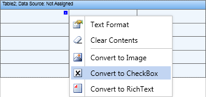
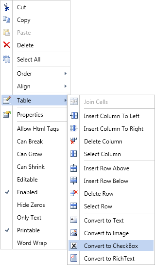

## CellType Property

There are different types of cells can be placed In the Table component. They are a text, an image, a check, and a rich text.

 Text is a cell will be output as a text. Cell settings are the same as the settings of a Text component;

 Image is a cell will be output as a text.Cell settings are the same as the settings of an Image component;

 Check is a cell will be output as a check for Boolean types of data. Cell settings are the same as the settings of a Check component;

 Rich text is a cell will be output as a rich text. Cell settings are the same as the settings of a Rich Text component.

The CellType property is used to indicate a cell type.

Also it is possible to indicate a cell style by clicking the quick access button of a cell.

Or the context menu of a cell.

