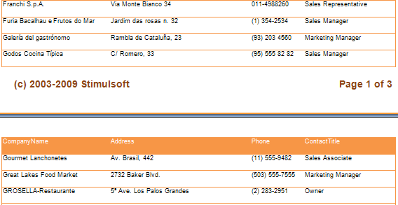
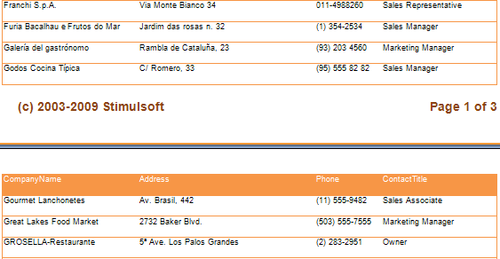
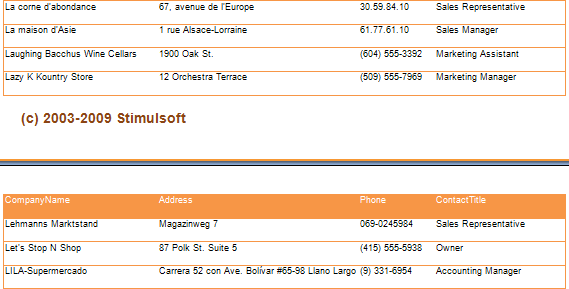

## AutoWidthType Property

The AutoWidthType property of a table indicates how the reporting tool will fix cells width after report rendering.

* None

Columns width is set depending on the cells contents of all table (the longest line by column is taken). If the FixedWidth property is set to true, then the column size is not changed.

* FullTable

Column width is set depending on the table width. In other words the width of all column cells is checked first (the column width is set by the longest line). If there is free space then it is equally distributed between all columns. If there is no enough space to output the longest lines, then the width of columns is decreased in equal parts between all columns.

* LastColumns

Column width is set depending on the table width. In other words the width of all column cells is checked first (the column width is set by the longest line). If there is free space then it is distributed to the last column which FixedWidth property is set to false. If there is no enough space to output the longest lines, then the width of the last columns is decreased and distributed between all columns which FixedWidth properties are set to false.

