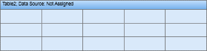

## Columns

The **ColumnCount** property of the Table component is used to define the number of columns in a table. On the picture below the table with 3 columns is shown.

On the picture below the table with 5 columns is shown.

