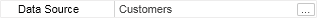
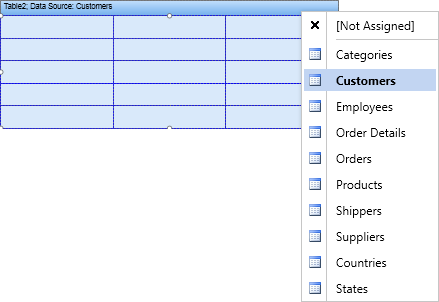

## DataSource Property

It is necessary to define the data source to output data in the Table component. The reporting tool should know how many times do cells must be printed in a table. Therefore, the Table component should have the reference to the data source. There are several ways how to do this. You may use the Table editor. Double click on the Table header to call the editor. Also the Table editor can be called using the DataSource property of a Table.

The Table editor allows selecting data source.

A data source can be selected by clicking the first tab of the editor. All data sources are grouped in categories. Each category corresponds to one connection with data in the report data dictionary. The picture below shows the Table editor.

The tab to select the data source;

Select this node if you do not need to specify the data source;

The "Demo" data category;

The "Demo" data source category.

The data source can be also selected using the quick access buttons.

