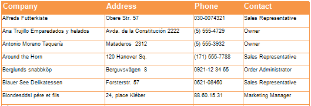
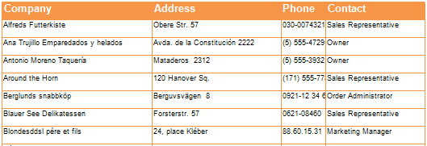

## FixedWidth Property

The FixedWidth property is used together with the AutoWidth property of a Table component. If a table changes the column size (depending on the AutoWidth property) then the FixedWidth property that is set to true does not allow these changes. On a pictures below samples of using these property is shown. On the first picture the FixedWidth property is not used.

On the second picture the FixedWidth property of the Phone column is set to true.

