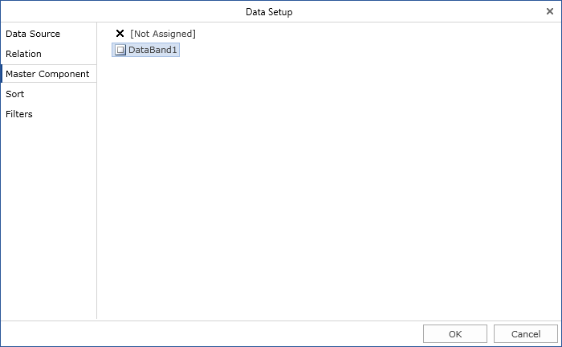
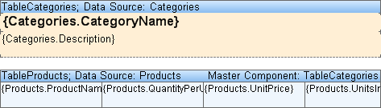
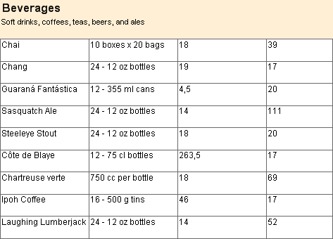

## MasterComponent Property

It is necessary to put two tables on a page for creating the Master-Detail using the Table component. Specify Master data source for the first table (this table is the Master table). Specify Detail data source to the second table (this table is the Detail table). Then you should bind these two tables using the **MasterComponent** property of a second table. There are several ways to set the Master table. The first way - you may set the Master table in the property grid.

The second way is to set the Master table in the Table designer.

After filling the **MasterComponent** component two tables will be related to each other. When printing one data row from the Master data source (and, correspondingly, printing the Master table), the printing of appropriate rows from the Detail data source occurs (and, correspondingly, printing the Detail table). The Detail band will not be printed separately, only in relation to the Master band. On a picture below two related tables are represented.

The picture below shows the result of two tables rendering.

