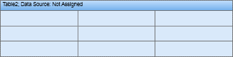
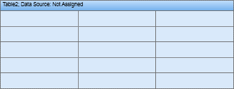

## Rows

The RowCount property of the Table component is used to define the number of rows in a table. On the picture below the table with 3 rows is shown.

On the picture below the table with 5 rows is shown.

