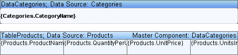

## Tables and Bands in Master-Detail Lists

It is allowed binding bands and tables when rendering the Master-Detail reports. For example, the master component can be a band and the Detail component can be a table. The template of such a report is shown on a picture below.

The number of Data bands and Tables which interacts between each other is unlimited.
