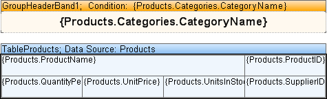
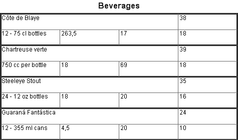

## Tables and Grouping

It is easy to add grouping to a report with a table. For this you should put the **GroupHeader** band before the **Table** component and the **GroupFooter** band after the Table. The condition of grouping is specified for the **GroupHeader** component. The text component that outputs the condition of grouping is placed in the **GroupHeader** band. It is enough to group a table by the specified condition. On a picture below the table of grouping is shown.

See the picture below that demonstrates the report with grouping and a table.

