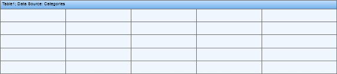

## Table

The **Table** component is used to output data in a report. This component is similar to spreadsheets. The table consist of rows and columns in what data can be placed. See on a picture below a Table component with 5 columns and 5 rows.

* This component is designed to simplify the work in the designer. When the report is rendered, the table is converted into a set of bands and text components. If you need more flexibility, we recommend you avoid the use of tables in favor of bands, text and other components.
