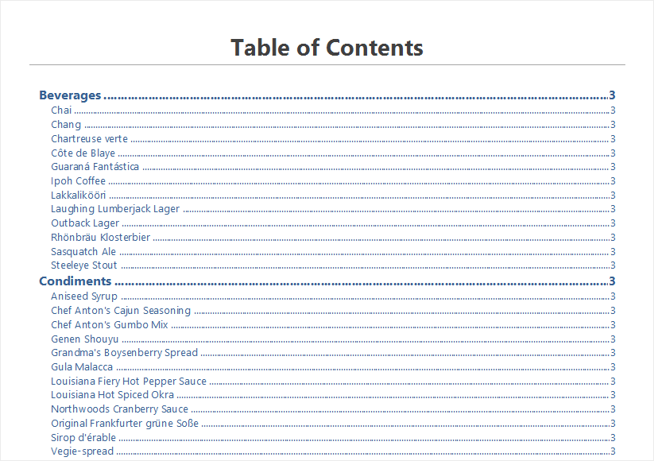
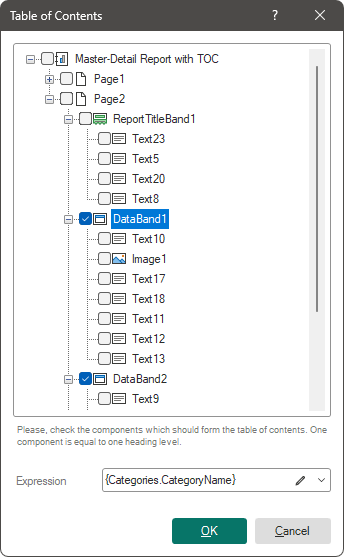
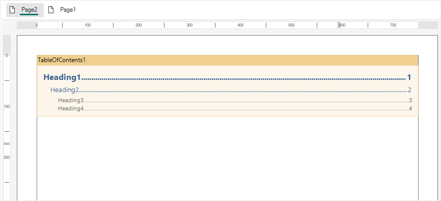
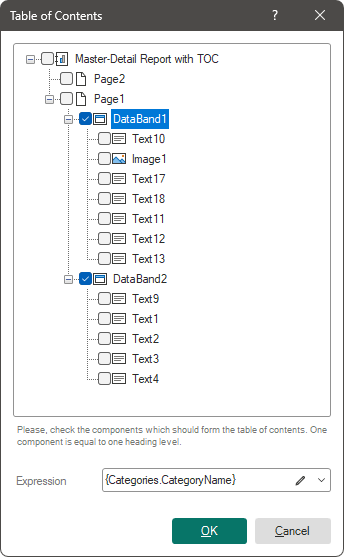

## TOC Component

The **Table of Contents** component is designed to automatically generate a table of contents in reports. The table of contents can be created by various components and in several levels.

Set up the table of contents using:

* The [component editor](#editor), in which you select components to form table of contents levels;

* [A list of properties for this component](#tableofproperties).

To call the editor:

* Double-click on the **Table of Contents** element;

* Select the **Table of Contents** element and select the **Design** command in the context menu;

**Component Editor**

In the table of contents editor, the hierarchy of the arrangement of report components is presented. A table of contents will be created for the selected components, taking into account the logical hierarchy. For example, if the second selected component is a second-level component in relation to the first, then it will be a second-level heading in the table of contents.

* The report tree field represents the hierarchy of the components' locations in the report;

* The Expression field specifies a data column or other expression, the results of which will be the values for the table of contents in the report.

**Creating a table of contents**

Here is an example of creating a table of contents for a Master-Detail report. First, decide whether the table of contents will be at the beginning, the end, or any other place in the report. Accordingly, the **Table of Contents** component should be placed in the template before or after the report components that form the report. In this example, the table of contents will be at the beginning of the report. The **Table of Contents** component can be added to the same template page where the main components are located. However, it is preferable to add a separate page in the template and place the **Table of Contents** component on it.
The Master-Detail list is created using the DataBand1 and DataBand2 bands, where DataBand1 is the master and DataBand2 is the detail. In terms of the location of components in the report, these bands are on the same level. However, in the logical hierarchy of reporting, DataBand2 is subordinate to DataBand1. Accordingly, when creating a table of contents, entries from DataBand1 will be at the first level, and entries from DataBand2 will be at the second level.
Thus, if you select DataBand1 and DataBand2 in the **Table of Contents** component editor, a two-level table of contents will be generated in the rendered report

Now let's look at an example of adding a table of contents step by step:

**Step 1**: Open a report, for example Master-Detail;

**Step 2**: In the report template let’s add page **Page2** before the main report page;

**Step 3**: Add a **Table of Contents** component to this page;

**Step 4**: Call the component editor and select the components for which you want to create a table of contents. For example, DataBand1 and DataBand2;

**Step 5**: Change the expression. This step is optional. Default values ​​can be used;

**Step 6**: Click **OK** in the **Table of Contents** component editor.

After that, open the report for viewing. The table of contents for the report will be generated automatically.

**Table of Properties**
The list shows the name and description of the properties of the **Table of Contents** component.

| **Name** | **Description** |
| --- | --- |
| Indent | Specifies the indent for a nested level, in relation to the previous one, in the hierarchy of table of contents values. |
| Margins | A group of properties is used to specify the offsets of values ​​from the borders of this component. |
| New Page Before | Inserts a blank page in the generated report before the report table of contents page. If the property is set to **True**, then a new page will be added before the **Table of Contents** component. If the property is set to **False**, then the new page will not be added. |
| New Page After | Inserts a blank page in the generated report after the last page of the table of contents. If the property is set to **True**, then when the report is built, a new page will be added after the **Table of Contents** component. If the property is set to **False**, then the new page will not be added. |
| Right to Left | Enables **Right to Left** mode for the **Table of Contents** component. If the property is set to **True**, then when building a report, the right to left mode will be set for the **Table of Contents** component. If the property is set to **False**, then the left to right mode will be used. |
| Style | Customizes appearance styles for values ​​at each hierarchy level in the table of contents. |
| Word wrap | Enables line wrapping mode for table of contents. If the property is set to **True**, then a long table of contents ​​will be carried over to the next line. If the property is set to **False**, then long table of contents values ​​will not be transferred. |
| Height | Changes the height of a component in the mode of editing reports. However, when building a report, the height of the component may grow to display the entire list of table of contents values ​​for the report. |
| Max Height | Sets the maximum height of a component in report editing mode. The default is set to 0, i.e. the maximum height is not limited. |
| Min Height | Sets the minimum height of a component in report editing mode. The default is set to 0, i.e. the minimum height is not limited. |
| Borders | A group of properties is used to enable and customize the appearance of the component's borders. |
| Conditions | Calls the **Conditions** editor. |
| Component Style | Sets a component style. |
| Use Parent Styles | Uses owner styles, i.e. component to which this component is subordinate. If the property is set to **True**, the owner's style will be applied when building the **Table of Contents** component. If the property is set to **False**, then the owner style will not be applied. |
| Enabled | Enables or disables component processing when generating a report. If the property is set to **True**, then when the report is built, the **Table of Contents** component will be processed and displayed in the report. If the property is set to **False**, then the **Table of Contents** component will not be built. |
| Name | Changes the name of the current element. |
| Alias | Changes the alias of the current element. |
| Restrictions | Configures the permissions to use the current component: The **Allow Change** option enables or disables changes of the component. If checked, the current component can be changed. If unchecked, the component can`t be changed. The **Allow Delete** option enables or disables the deletion of an component. If checked, the current component can be deleted. If unchecked, the component can`t be deleted. The **Allow Move** option allows or prohibits moving an component. If checked, the current component can be moved. If unchecked, the component can`t be moved. The **Allow Resize** option enables or disables resizing of an component. If checked, the current component can be changed. If unchecked, the component can`t be changed. The **Allow Select** option enables or disables the component selection. If checked, the current component can be selected. If unchecked, the component can`t be selected. |
| Locked | Allows resizing and moving the current element. If the property is set to **True**, then the current element cannot be moved or resized. If this property is set to **False**, then it can be moved and resized. |
| Linked | Links the current location to a dashboard or other element. If the property is set to **True**, then the current element is bound to the current location. If this property is set to **False**, then this element is not bound to the current location. |
