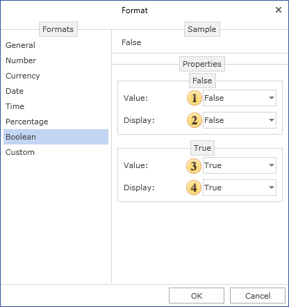

## Boolean Values Formatting

This format is used to format values of the boolean type.

 The string value to identify boolean values as false;

 The string value to represent boolean value as false;

 The string value to represent boolean value as true;

 The string value to represent the boolean value as true.
