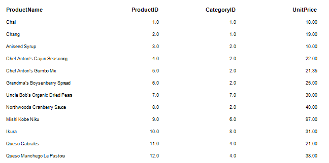
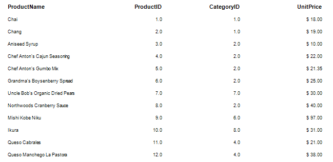
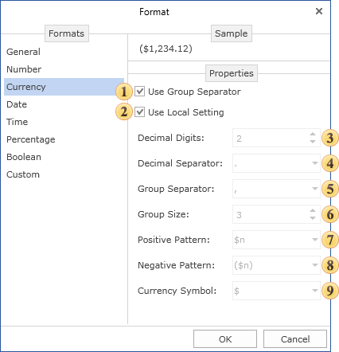
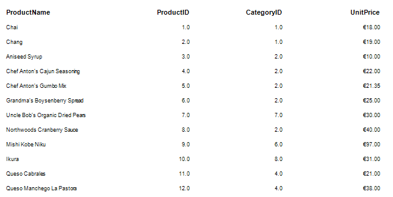

## Currency Formatting

To display numeric values as a currency you should use the Currency format. This format is designed specifically to output monetary values.

Set the currency format for the UnitPrice column.

> **Information**
>
> * **Information:** It is understood that when setting the currency format, the important point is the selection of the required currency. The same value can be either the US, European Union, China currency and the currency of any other country.

For example, the prices are in US dollars. Then, select the appropriate currency sign, and determine the parameters of the format.

It should be noted that previously there were two ways to determine the format mask:

* Use local settings, the text is formatted according to the current settings of the operating system.

* Each parameter is defined by the format mask manually.

Sometimes there were some disadvantages in both cases. For example, when using local settings to change the format parameters you should edit formats of the operating system. In the second case, when it is needed to change one parameter you should adjust others as well. Considering disadvantages of these methods, there is a third way to determine the format. Using the local settings you can change any parameter format. To do this, set the flag next to the parameter and set its value.

 Group separator

When the Group Separator is used then currency values will be separated into number positions.

 Local setting

When using the Local settings, currency values are formatted according to the current OS installations.

 Decimal digits

Number of decimal digits, which are used to format currency values.

 Decimal separator

Used as a decimal separator to separate currency values in formatting.

 Group separator

Used as a group separator when currency values formatting.

 Group size

The number of digits in each group in currency values formatting.

 Positive pattern

This pattern is used to format positive values.

 Negative pattern

This pattern is used to format negative values.

 Currency symbol

This symbol is used to define the currency name.

Let's go back to the example described above. Change the values only for the Positive Pattern and Currency Symbol parameters. Other parameters will be determined by local settings.

