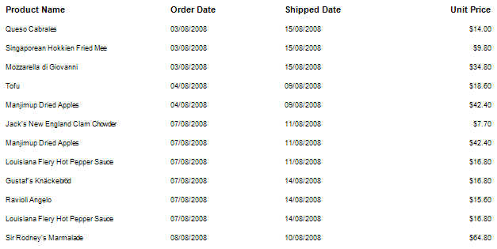
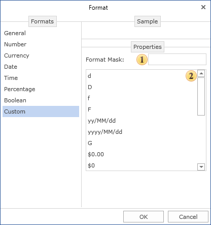
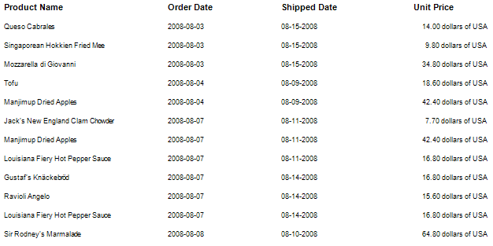

## Custom Formatting

If, for some reason there are no predefined formats appropriate for you, then you can customize the format according to your needs. For example you have a report with a list of products, Order Date, Shipped Date, and the price of the product. Let's apply to them predefined date formats and local settings for the price.

Now let's set the format mask for each text component. To do this, select the text component, call the **Format** dialog, go to the Custom tab and create a mask.

 **Mask**

A string or an expression that set formatting mask.

 **Predefined values**

The list of predefined values to format a string.

For the Order Date the mask has the form **yyyy-MM-dd**, Shipped Date - **MM-dd-yyyy**. For the price of a product the mask is **0.00 dollars of USA**. The data in the rendered report will be formatted as in the picture below.

Thus, you can create masks of different formats.
