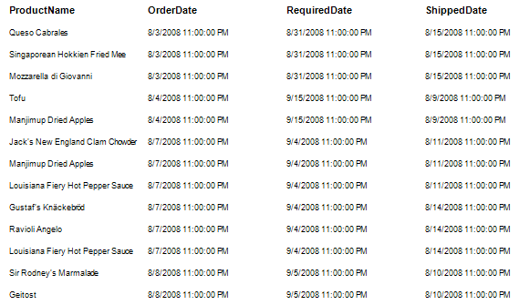
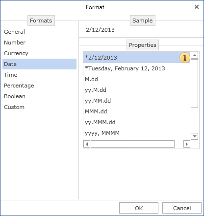
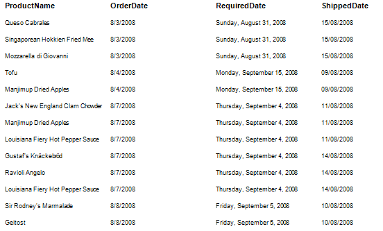

## Date Formatting

If the report contains text components which output date in the rendered report then the Date formatting can be applied to this text component. The date format is selected from a set of specified formats - short format, long format, etc. In the applied format, except the ones with an asterisk (*), the order of elements does not change. For example, the report contains the list of products and OrderDate, RequiredDate, ShippedDate.

By default, it displays the date and time. Set dates for the various formats. To do this, select the text component, call the **Format** dialog, go to the **Date** tab, and select the appropriate type.

 **Date format**

The list of formatting types.

And then, the dates in the report will be displayed with certain formats.

> **Video**
>
> * **Notice:** In addition to the formats on the **Date** tab, you can create a format on the **Custom** tab.
