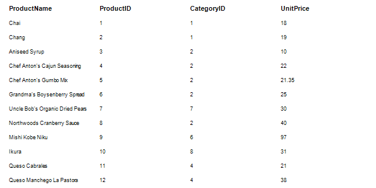
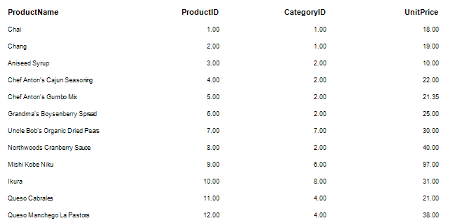
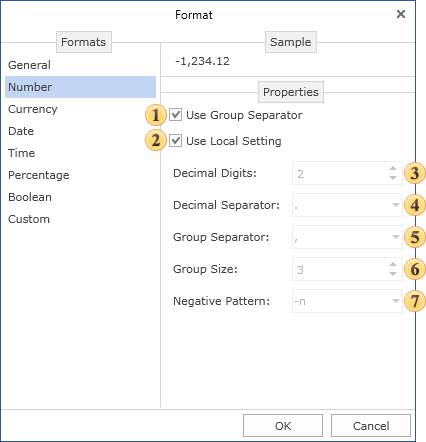
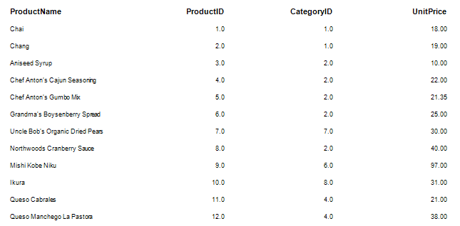

## Numerical Formatting

To display numeric values, it is recommended to use a numeric format. Below is a report with a list of products, their price, as well as key product and category. By default, all text components use a text format General without any formatting.

Set the numeric format for the values **ProductID**, **CategoryID**, **UnitPrice**. For this you should select the text components which contain references to the relevant data columns and click the 

 button of the **Text Format** property. In the **Format** dialog box you should go to the **Number** tab and define the settings.

It should be noted that there were two ways available to determine the format mask:

* Use local settings. The text is formatted according to the current settings of the operating system.

* Each parameter is defined by the format mask manually.

Sometimes there were some disadvantages in both cases. For example, when using local settings to change the format parameters you should edit formats of the operating system. In the second case, when it is needed to change one parameter you should adjust others as well. Considering disadvantages of these methods, there is a third way to determine the format. Using the local settings you can change any parameter format. To do this, set the flag next to the parameter and set its value.

 Group separator

When the Group Separator is used then number will be separated into number positions.

 Local setting

When using the Local settings, numerical values are formatted according to the current OS installations.

 Decimal digits

Number of decimal digits, which are used to format numerical values.

 Decimal separator

Used as a decimal separator to separate numerical values in formatting.

 Group separator

Used as a group separator when numerical values formatting.

 Group size

The number of digits in each group in currency values formatting.

 Negative pattern

This pattern is used to format negative values.

Thus, for columns ProductID, CategoryID we change only the number of digits in the fractional part.

> **Video**
>
> * **Notice:** To display currency values you should use the Currency format. In the example above, for the **UnitPrice** column you should set the Currency format.
