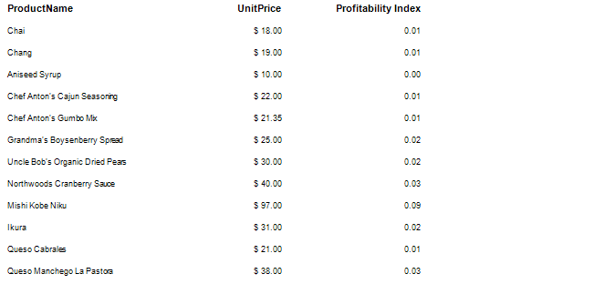
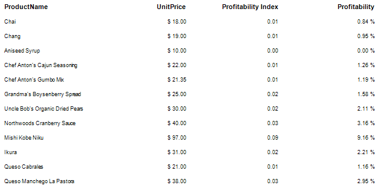
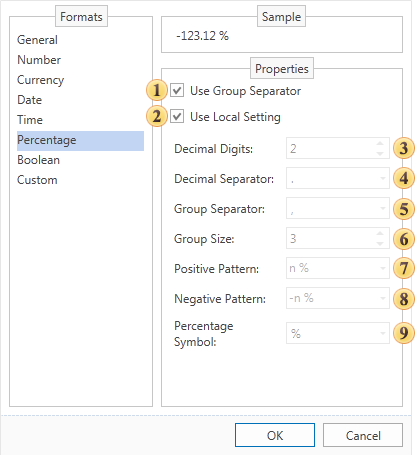

## Percentage Data Formatting

If the report uses the relative values, the current data can be output as a percentage text format. Consider the example of a report with relative values. Let's have a report that contains a list of products (standard format), their price (currency format) and the profitability index (number format).

Now let's add a column with profitability. In this case, the profitability is the ratio as a percentage value. To do this, add the text component on the right with the reference to the Products.ProfitabilityIndex column and set the format as percent for this text component. The header of this column will be Profitability.

It should be noted that previously there were two ways to determine the format mask:

* Use local settings, the text is formatted according to the current settings of the operating system.

* Each parameter is defined by the format mask manually.

Sometimes there were some disadvantages in both cases. For example, when using local settings to change the format parameters you should edit formats of the operating system. In the second case, when it is needed to change one parameter you should adjust others as well. Considering disadvantages of these methods, there is a third way to determine the format. Using the local settings you can change any parameter format. To do this, set the flag next to the parameter and set its value.

 **Group separator**

When the Group Separator is used then currency values will be separated into number positions.

 **Use local setting**

When using the Local settings, numerical values are formatted according to the current OS installations.

 **Decimal digits**

Number of decimal digits, which are used to format numerical values.

 **Decimal separator**

Used as a decimal separator to separate numerical values in formatting.

 **Group separator**

Used as a group separator when numerical values formatting.

 **Group size**

The number of digits in each group in currency values formatting.

 **Positive pattern**

This pattern is used to format positive values.

 **Negative pattern**

This pattern is used to format negative values.

 **Percentage symbol**

The symbol will used as a percent sign.
