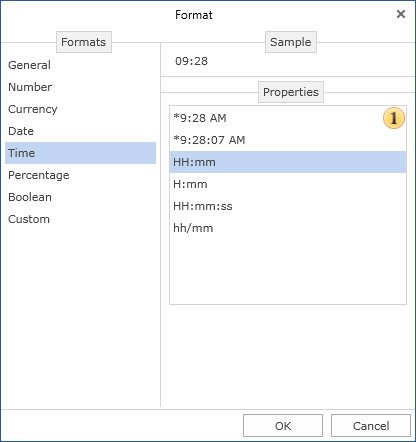
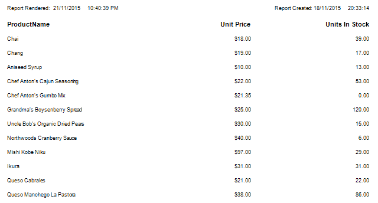

## Time Formatting

The Time format is used to show time. The Time format is selected from the set of formats: short date format and extended date format (with seconds).

Time format

 The list of formatting types

Below is an example of the report with the Time output and applied format to text components.

