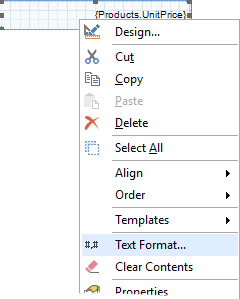
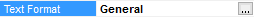
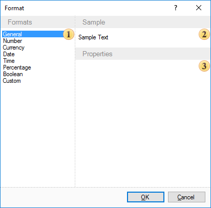

## Text Formatting

The Text format is a representation of information in the special form (grouping and data output, to the specified pattern). Stimulsoft Report contains all necessary instruments required for formatting of all information that will be output. The Text Format is the basic tool for formatting a text before output. This tool is a dialog box, which allows setting parameters of format. Text format dialog box is called from the context menu, that appears when right-clicked on the text components, which supports formatting.

Also, using TextFormat properties, the dialog box can be called.

The Format window is divided into three parts.

 A section where the formatting type can be chosen.

There are some types of showing a text:

* Standard - output data without specific number format;

* Number — this format is used for general display of numbers;

* Currency — this format is used for general monetary values;

* Date — this format is used to display date values;

* Time — this format is used to display time values;

* Percent — this format is used to display a result in percent symbol;

* Boolean — this format is used to display Boolean values;

* Custom — custom data formatting.

 Shows how the formatted text will look like;

 Shows the format settings.
