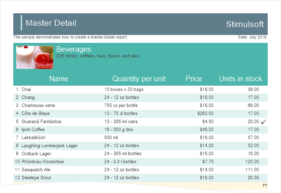

## Totals Associated with Bands

| Important |
| --- |
| Scripts can be a security risk, so they are disabled in the [Interpretation mode](../../Reports_Designer/Template/Calculation_Mode.md). However, if you are confident in the safety of your scripts, you can use them in the [Compilation mode](../../Reports_Designer/Template/Calculation_Mode.md). |

To calculate and display the total, you should place a text component in the report, call the editor and go to the Summary tab.
 The **Expression** field. This field specifies an expression of calculating totals. The expression can be specified manually, or it will be generated automatically, depending on the type of other parameters.

 The **Summary Function** field. In this field, the function of calculating totals is selected.

 In this field, you can specify the **Data** **band** by which the total will be calculated.

 In this field, you can specify by the data column which values will be used to calculate the total.

 Using the radio buttons, you can set the object for calculating totals:

  * **Report**. The total will be calculated for the entire report.

  * **Column**. Totals will be calculated by every column in the report.

  * **Page**. Totals will be calculated by every page of the rendered report.

 The Running Total parameter. If the flag is checked, then the total will be calculated as running. If unchecked, then the total will be calculated only by the project (report, column, page).

 The Conditions parameter. If the flag is checked, then the condition will be considered when calculating the totals. If unchecked, then the total will be calculated without considering conditions.

 The field specifies an expression of a condition.

The type of the total function result

By default, the function for calculating totals returns the Decimal type (except for the functions - Count and CountDistinct). However, you can also make calculations using two other data types - Double, and Int64. For the function returns the result of the calculation using the Double data type, add the Latin letter D in the upper register to the name of the function. For calculations using the Int64 type, you should add the Latin letter I in the upper register. This separation will allow avoiding losses in the calculation of totals.

| Function | Type of returned value |
| --- | --- |
| Sum() | Decimal |
| SumD() | Double |
| SumI() | Int64 |

> **Video**
>
> * Notice: The letters I, D can be added to any function except Count and CountDistinct. These functions always return the Int64 type.

Some words about the function syntax

When using the C# programming language, all the functions should be written strictly in compliance with the register.

Sum (expression) - the sum is calculated by the automatically identified object.

Sum (band, expression) - the sum is calculated by the particular object.

SumIf (band, expression, condition) - the sum is calculated by the object with the condition.

expression - the expression for calculation;

band - the name of the band to execute calculation;

condition - the condition of including the calculation into the expression.

In the case with calculations by a page or a container, the syntax is the same except for the addition of the Latin letter c as the prefix to the function name:

cSum (expression) - calculation of the sum by the page or container;

cSum(band, expression)  - calculation of the sum by the page or container and object on it;

cSumIf (band, expression, condition) - calculation of the sum by the page or container and object on it, under certain conditions.

To calculate totals by the column, add the col prefix to the function name:

colSum (expression) - the sum is calculated by the column;

colSum (band, expression) - the sum is calculated by the column and an object in it;

colSumIf (band, expression, condition) - the sum is calculated by the column and objects in it, under certain conditions.

The Count function differs from the rest of the functions that it has no expressions for calculation. The syntax for this function is shown below.

Count() - calculates the number of rows;

CountIf(condition) - calculates the number of rows by the condition;

Count(band) - calculates the number of rows by the object;

CountIf(band, condition) - calculates the number of rows by the object and condition;

cCount() - calculates the number of rows by the page and container;

cCount (band) - calculates the number of rows by the page (container) and an object on it;

cCountIf(band, condition) - calculates the number of rows by the page (container) and an object on it under certain condition;

colCount() - calculates the number of rows by the column;

colCount (band) - calculates the number of rows by the column and the object in this column;

colCountIf(band, condition) - calculates the number of rows by the column and the object in the column under certain conditions.

Showing totals in any place

Typically, the components, in the text expression of which the function call is specified, are placed on the footer band on the Data band. There are several types of footer bands:

ReportSummaryBand - the band is used to display totals for the entire report;

PageFooterBand - the band is used to display totals by the page;

FooterBand - the band is used to display totals by the list;

GroupFooterBand - the band is used to display totals by the group.

ColumnFooterBand - the band is used to display totals by the column.

The position of components with functions in any of the bands mentioned above allows the report generator to determine exactly to what data band this function is applicable. Also, a component with the functions can be placed on the Data band. In this case, on each data row, the result of the function calculation by all rows will be displayed.

If you want to display the total, for example, on the Header band, then this is done using a script. However, in Stimulsoft Reports, the component with the function may be in any band of the report.

> **Video**
>
> * Notice: The components with functions can be placed anywhere in the report.

It is also allowed to place a component with the function on a page and other pages of the report template. For example, it is possible to calculate the sum of values by the list and output it in the header list. Another example, calculate the number of rows in the list and output the value at the beginning of the page. At the same time, there is a limitation: you must specify the Data band, in which the result will be calculated:

{Sum (DataBand1, Products. UnitsInStock)}. In this case, the total will be calculated for the Products.UnitsInStock column values for each row of DataBand1.

{Count (DataBand1)}. In this case, the number of rows of DataBand1 will be calculated.

Expressions with functions

To calculate the totals, it is possible not to specify additional arguments in the expression. For example, for the Count function, it is optional, or only one argument can be set for the Sum function - an expression that should be calculated. All this is possible if the report generator can determine to which Data band those functions are related.

> **Video**
>
> * Notice: The report generator can determine the relationship between functions and specific Data band if the component with this function is related to the band with the Data band. In other words, the component with the function is located on the Header and Footer bands that relate to this Data band.

Otherwise, in the arguments, you should specify the data source or a Data band on which it is necessary to calculate the total. The following can be specified in expressions:

The object which values will be calculated - {Sum (DataSource.Column)}

The object and various mathematical operations with them - {100 + Sum (DataSource.Column) * 2}

Calculation of totals by the page

To calculate the total by the page or panel, you should add the Latin letter "c" in lower case as a prefix to the name of the function:

{AcCount (DataBand1)} - the report engine calculates the number of lines on one page or a panel.

> **Information**
>
> * Notice: The calculation of totals by the page has the same principle as for the panel.

When calculating totals by the panel or page, it is desirable to specify the Data band by which goes the calculation of the aggregate function. It is necessary because there may be more than one Data band on one page.

On one page or panel, you can use any number of aggregate functions. Stimulsoft software does not have any restrictions on this. It is allowed to combine the totals by the page with the condition. For example:

{CountIf(DataBand1, Products.UnitsInStock = 0)} - the report engine calculates the number of items on this page which are equal to zero.

Calculation of totals by column

To calculate the total by a column, you must add the prefix col (from the word column) in the lowercase to the name of the function. For example:

{ColCount ()} - the report engine calculates the number of rows in each column.

> **Video**
>
> * Notice: The calculation of totals by a column in Stimulsoft Reports has one limitation. Totals can be calculated only by the columns on the page. Calculation of totals by the columns on the Data band is not allowed.

When calculating totals by the column, it is desirable to place text components with functions on ColumnHeader, ColumnFooter, Header, or Footer bands. You can calculate an unlimited number of totals by the column. There are no restrictions on this. It is also allowed to combine the footers by the column with the condition:

{ColCountIf(DataBand1, Products.UnitsInStock = 0)} - the report engine calculates the number of rows in each column, where the condition will be executed.

Calculating totals in the event code

Using Stimulsoft software, you can calculate functions in the code of the report event. It provides the ability to calculate the more complex functions. Also, in this case, you can refer to the calculated value from the code in the process of calculation and influence this process. To make this calculation, you should create a variable in the data dictionary, which will store the value of the function.

> **Information**
>
> * Notice: Do not use variables declared in the code to store the result of the calculation of functions. You must use the variables from the data dictionary.

When creating a variable, the data type of the variable is indicated. For example, Decimal, and the initial value, for example, 0. Then, in the Data band, indicate an expression to increment a variable in the Rendering event. For example, if you want to calculate the sum of the values by the field Products.UnitPrice field, the expression will be the following:

Variable + = Products.ItemsInStock;

To display the result of calculation, you should place the text component with the expression:

{Variable}

Also, you must have a text component with the expression {Variable}, set the Process At property to the End of Report value. It is necessary that the report generator calculates the value of the variable after processing the remaining components.

Calculation of totals with condition

Sometimes, when calculating totals, it is necessary to consider certain values. In this case, the condition is set to function of calculating the totals. For example, it is necessary to sum the values that are greater than zero. To add a condition to the function of calculating the totals, you should to add a suffix If (the Latin alphabet) to the function name, and add an additional argument with the condition:

{SumIf (Products.UnitsInStock, Products.UnitsInStock&gt; 1)}. In this case, the amount of Products.UnitsInStock values will be calculated, which is greater than 1.

{CountIf (Products.UnitsInStock == 0)}. In this case, the number of rows with a zero value in the column is calculated UnitsInStock

> **Information**
>
> * Notice: If you want to make a calculation using a Double or Int64, you must first add the Latin letter D or I, and then the word If. For example: {SumDIf(Products.UnitsInStock,Products.UnitsInStock&gt; 0)}.

Totals and automatic changing the size of the component

> **Video**
>
> * Notice: When rendering a report, at the moment, when the size of the component is determined, the result of the calculation of the total function is still unknown. This should be considered when installing the automatic resizing for the components in which the calculation of totals is done. Otherwise, an issue may arise when the size of the component is not correct in relation to the result of the calculation of the total function.

Totals with the disabled Data band

The Data band can be disabled in a variety of ways. For example, it can be disabled by a certain condition, or it may have a zero height. By default, when rendering a report, the report engine does not take into account disabled data bands and will not process them. However, if it is necessary to calculate totals by the disabled Data band, then you should set the CalcInvisible property for this band to true. In this case, the report will only be displayed the Data included bands, and calculation of totals will be executed considering the Data band.

Calculating totals in Master-Detail reports

When calculating totals in hierarchical reports, there are some issues in calculating the result. Consider an example based on the Master-Detail Report. Suppose the report shows a list of product categories. Categories, in this case, are master entries, and products are detail entries:

Suppose you want to count the number of products to be displayed in the report. If you add the Footer band with the function Count() to the band with a list of products (detail records), then, by each category (a master record), totals will be calculated:

If you add the Footer band with the function Count() to the band with the categories, the result is the number of master entries in the report, the number of categories. However, in the Master-Detail report, you can calculate the totals immediately for all detail records. In this case, you must specify the names of both (master and detail) bands as a function with a colon: Count(MasterBand:DetailBand).

The result of the Count(MasterBand:DetailBand) function is the number of products in all categories.
