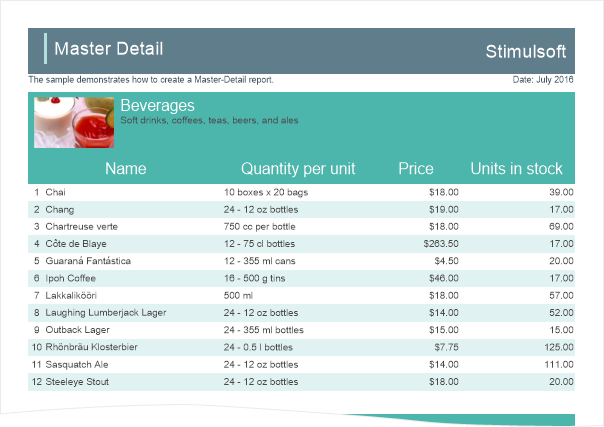
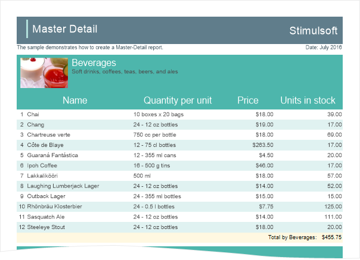
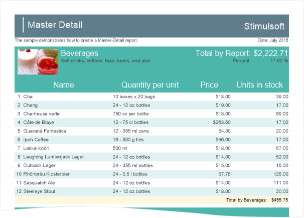

## Totals not Related to Bands

The calculation of totals in reports can be made by specifying an expression, for example, {Sum(DataBand1)}. At the same time, the totals are calculated when rendering the report: each time when an operation with DataBand in carried out, a single value is calculated. Then, all calculated values are added together and the total value will be displayed. In this case, totals are associated with bands. The calculation of totals in Stimulsoft Reports can be made in another way - instantly. In other words, calculate the total not associated with bands. To do this, use the special prefix Totals before the function with the separator ".", For example, {Totals.Sum(DataBand1)}. Calculation of functions with the prefix Totals occurs where the function was called, as opposed to the totals associated with bands, the calculation of which is performed during rendering the report.

**Totals Functions:**

| **Function** | **Description** | **Sample** |
| --- | --- | --- |
| {Avg()}when | Calculates the arithmetic mean: In arguments, specify an object or two objects Returns values of different types (double, decimal, long, DateTime, TimeSpan), depending on the function selected. | {Avg(DataSource.Column1)} - the arithmetic mean of the Column1 column will be calculated. {AvgDate(DataSource.ColumnDate)} - the average of the date on the ColumnDate column will be calculated. {AvgTime(DataSource.ColumnTime)} - the average time by the ColumnTime column will be calculated. All functions can have two arguments. For example, the report uses several Data bands. It is necessary to calculate the arithmetic mean for the first Data band. In this case, the first argument is the band, the second is the object for calculation - {Avg(DataBand1,DataSource.Column2)}. As a result, the arithmetic mean of Column2 will be calculated, but only for the DataBand1 values. |
| {Count()} | Calculates the number of values or the number of unique values: In arguments, specify a value, object or two objects Returns the values of various long types | {Count()} - the result is the number of entries in the data source. {Count(DataBand1, DataSource.Column1)} - the result is the number of entries in Column1 column for DataBand1. {CountDistinct(DataSource.Column1)} - the result is the number of unique entries in DataSource.Column1. {CountDistinct(DataBand2, DataSource.Column2)} - the result is the number of unique entries in Column2 column for DataBand2. |
| {First()} | Displays the first value from the specified object: In arguments, specify an object or two objects Returns the values of various object types | {First(DataSource1.Column1)} - the result is the first value of Column1 from the DataSource1. {First(DataBand2, DataSource.Column2)} - the result is the first value of Column2 of the DataBand2 band. |
| {Last()} | Displays the last value from the specified object: In arguments, specify an object or two objects Returns the values of various object types | {Last(DataSource1.Column1)} - the result is the last value of Column1 from the DataSource1. {Last(DataBand2, DataSource.Column2)} - the result is the last value of Column2 of the DataBand2. |
| {Max()} | Displays the maximum value from the specified object: In arguments, specify an object or two objects Returns the values of various double, decimal, long, DateTime, TimeSpan, string types depending on the function selected. | {Max(DataSource1.Column1)} - the result is the maximum value from Column1 of DataSource1. {MaxDate(DataSource1.ColumnDate)} - the result is the maximum date from the ColumnDate of the DataSource1. {MaxTime(DataSource1.ColumnTime)}  - the result is the maximum time from the ColumnTime of the DataSource1. {MaxStr(DataSource1.Column1)} - all values will be sorted alphabetically. The result is the last value. {Max(DataBand2, DataSource.Column2)} - the result will be the maximum value of Column2 of the DataBand2 band. |
| {Median()} | Displays the mean (non-arithmetic) value from the list: In arguments, specify an object or two objects Returns the values of various double, decimal, long types, depending on the function selected. | Suppose, Column1 contains 5 values: 2, 5, 6,1,7. The {Median(DataSource1.Column1)} function displays the average value from this list, i.e. the result is 6. {Median(DataBand2, DataSource.Column2)} - the result is the average value of Column2 of the DataBand2. |
| {Min()} | Displays the maximum value from the specified object: In arguments, specify an object or two objects Returns the values of various double, decimal, long, DateTime, TimeSpan, string types depending on the function selected. | {Min(DataSource1.Column1)} - the result is the minimum value from Column1 of DataSource1. {MinDate(DataSource1.ColumnDate)} - the result is the minimum date from the ColumnDate of the DataSource1. {MinTime(DataSource1.ColumnTime)} - the result is the minimum time from the ColumnTime of the DataSource1. {MinStr(DataSource1.Column1)} - all values will be sorted alphabetically. The result is the first value. {Min(DataBand2, DataSource.Column2)} - the result is the minimum value of Column2 of the DataBand2 band. |
| {Mode()} | Displays the value that is most common in the list of values: In arguments, specify an object or two objects Returns the values of various double, decimal, long types depending on the function selected. | {Mode(DataSource1.Column1)}. Suppose, Column1 contains a list of values: 2, 2, 6, 7, 7, 8, 7, 6, 5, 9, 4. In this case, the result is 7, because it is most often repeated in the list of values. {Mode(DataBand2, DataSource.Column2)}  - the result will be the value from Column2 of the DataBand2, which is the most common. |
| {Rank(,)} | Display the rank of the value. The prefix Totals is mandatory: Specify in arguments:  Objects for processing and assigning rank (the object type)  The value (true or false) for assigning a tight or not tight rank  Sorting direction of values. Returns the values of various long types | {Totals.Rank(DataBand1,DataSource.Column1)}. Suppose, Column1 contains a list of values: 44, 9, 36, 55, 71. In this case, the values will be sorted in ascending order, i.e. 9, 36, 44, 55, 71 and to each of them a rank will be assigned. The number 9 will receive rank 1; 36 - rank 2; 44 - rank 3; 55 - rank 4; 71 - rank 5. By default, calculates a tight rank and sorts the values for assigning rank by ascending order {Totals.Rank(DataBand1,DataSource.Column1, true, StiRankOrder.Dess)} - in this case, there will be a tight rank since it is set to true. When the rank is assigned, the values will be sorted in descending order since StiRankOrder is set to Desc. For sorting in ascending order (used by default), you should set to Asc (StiRankOrder.Asc). An example of a not tight rank is {Totals.Rank(DataBand1, DataSource.Column1, false, StiRankOrder.Asc)}. Assume Column1 contains a list of values: 44, 9, 44, 9, 31, 64,68, 71. The values are assigned in ascending order, i.e. 9, 9, 31, 44, 44, 44, 68, 71. In this case, the ranks will be as follows: 9 - rank 1, 9 - rank 1, 31 - rank 3, 44 - rank 4, 44 - rank 4, 44 - rank 4, 68 - rank 7, 71 - rank 8. In other words, when assigning a rank to a number, the rank of the previous value and the number of values with this rank are taken into account. |
| {Sum()} | Displays the result of the sum of the values: Specify in arguments:  Objects for processing and assigning rank (type object)  Condition  Summation expression Returns the values of various long, decimal, double, TimeSpan types | {Sum(DataSource1.Column1)} - the result is the sum of all Column1 values in the DataSource1. {SumDistinct(DataSource1.Column1)} - the result is the sum of all the unique Column1 values in the DataSource1. SumTime(DataSource1.Column1) - the result is the sum of the time from Column1 in the DataSource1. {Sum(DataBand2,DataSource2.Column2)} - the result is the sum of the values from Column2 of the DataBand2. {SumDistinct(DataBand1,DataSource.Column1, DataSource.Column2)} - the result is the sum of the Column2 values that correspond to the unique values from Column1 of the DataBand2. |

**Samples to calculate totals not associated with bands.**

For example, there is a Master-Detail Report, which is a list of products by categories:

In this report, the result can be calculated for each category for the entire report. It is also possible to calculate the proportion of each category of the total. To begin, let's calculate the amount of product in a category. To do this, add the Footer band in the report template, put a text component with an expression of calculating totals {Sum(DataBand2,Products.UnitPrice)}. For the summation of values, the Sum function is used, its arguments specify the object by which the totals and data column will be calculated, the values ​​of which will be summarized. Since it is necessary to calculate the amount of product by each category, the object for calculating totals will be the detailed Data band, i.e. DataBand2. Values ​​in the UnitPrice column indicate the price of each product. Therefore, the sum of these values ​​will be the total for the category:

In this case, the result is associated with the Data band. To calculate the total by the report, use the functions which are not associated with bands. For this, add a prefix Totals to the function, through the "." separator. As an object, you should specify the data source. The expression for calculating totals in the report, will be {Totals.Sum(Products, Products.UnitPrice)}. The result is displayed on the master band.

Each time, when the master band is printed in the report, the total by the report will be shown. Using the results of calculations, it is possible to calculate the share of each category of the grand total. The result is displayed as a percentage. To calculate the proportion, you should divide the total by the category on the total by the report - {(Sum(DataBand2,Products.UnitsInStock) / Totals.Sum(Products, Products.UnitsInStock))}. For the text component, in which the share is displayed, set the percentage format. The result is displayed on the master band.

Thus, you can calculate any total in the report. To calculate the total not associated with bands you should use the prefix Totals to the name of the function, and use the "." separator.
