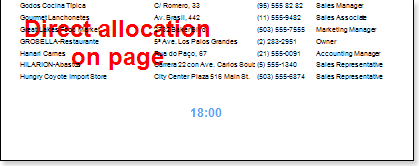

## Direct Allocation on Page

One of the options for placement of the "watermark" inscription is a direct placement on the page. This means that the direct placement of any component, which will be the "watermark" inscription on a page of a report template.

The picture above shows the "watermark" by means of the direct placement a text component on a template of a page.

Direct placement on a page allows showing an inscription on the background but at any of the working space.

There is the **Linked** property. This **Linked** property may have two values: **true** and **false**.

If the property is set to **false**, then the relation with "owner" is not fixed. In other words the "owner" is the report template item on which the **TextBox** component is placed.

If the property is set to **true**, then the relation with "owner" is fixed. In other words the **TextBox** component may change the position but it will be referred to the item on what it is fixed.
