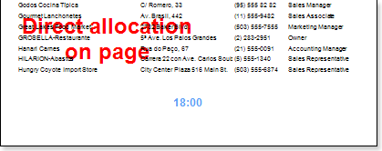

## Direct Allocation on Page

One way to place a watermark is to position it directly on the page. This means placing any component that will serve as the watermark directly on the report template page. The image below shows a "watermark" created by directly placing a text component on the report template page.

Direct placement on a page allows text to be displayed in the background anywhere in the working area. When TextBox component is placed directly on a page, the page of the report template becomes its "owner".

To prevent a text component placed on a page from changing its "owner", i.e., from becoming an element of one of the bands placed on the page, set the Linked property.

The **Linked** property can have two values: **true** and **false**.

If the property is set to **false**, the relationship with the "owner" is not fixed. In this case, the "owner" is the report template element on which the **TextBox** component is currently located.

If the property is set to **true**, the relationship with the "owner" is fixed. The **TextBox** component can be moved, but it remains associated with the element to which it was linked.
