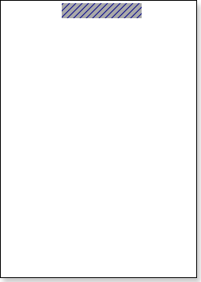
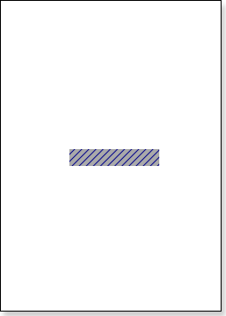
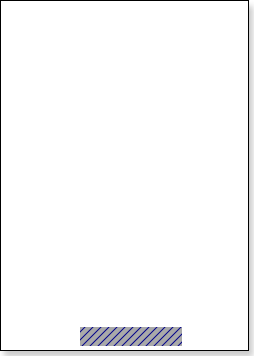

## Vertical Alignment Property

The VerticalAlignment property is used to define the place of the "watermark" inscription which is output using the Overlay band. This property may have three values:

* Top. The Overlay band will be output on the top of a rendered report before the page header and the page header.

* Center. The Overlay band will be output on the center of a rendered report and in front of data placed on the page.

* Bottom. The Overlay band will be output on the bottom of a page of a report and after the page footer.

