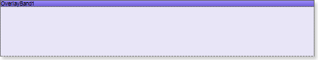

## Overlay Band

| Important |
| --- |
| Scripts can be a security risk, so they are disabled in the [Interpretation mode](../../../Reports_Designer/Template/Calculation_Mode.md). However, if you are confident in the safety of your scripts, you can use them in the [Compilation mode](../../../Reports_Designer/Template/Calculation_Mode.md). |

The Overlay band is used to output text, images, primitives and other data.

The Overlay band is placed on the top of all other bands. The Watermark, for example, is placed in the foreground or in the background. The advantage of the Overlay band over Watermark is that it is not a page element but a band which has properties of bands.

Watermark is either printed on all pages or not printed. The Overlay band band allows selecting 7 ways of printing. In Watermark, for the same operation script should be printed.

The PrintOn property has 7 values:

 All page;

 ExceptFirstPage;

 ExceptLastPage;

 ExceptFirstAndLastPage;

 OnlyFirstPage;

 OnlyLastPage;

 OnlyFirstAndLastPage.
