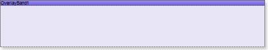

## Overlay Band

> **Important**
>
> Scripts can be a security risk, so they are disabled in the [Interpretation mode](../../../Reports_Designer/Template/Calculation_Mode.md). However, if you are confident in the safety of your scripts, you can use them in the [Compilation mode](../../../Reports_Designer/Template/Calculation_Mode.md).

The **Overlay** band is used to output text, images, primitives and other data.

The **OverlayBand** band is displayed over the data of the other bands, i.e., in the foreground. This differs from **Watermark**, where the watermark can be positioned either in the foreground or in the background. Nevertheless, the main advantage of **OverlayBand** over **Watermark** is that it is not simply a page element, but a separate band with the same properties as other bands. This provides a greater number of properties and features.

**Watermark** is either printed on all pages or not printed at all. The **OverlayBand** band, on the other hand, provides seven printing options that can be selected in its properties. To perform the same operation with **Watermark**, a script would have to be written.

The **PrintOn** property has 7 values:

 **All page;**

 **ExceptFirstPage;**

 **ExceptLastPage;**

 **ExceptFirstAndLastPage;**

 **OnlyFirstPage;**

 **OnlyLastPage;**

 **OnlyFirstAndLastPage.**
