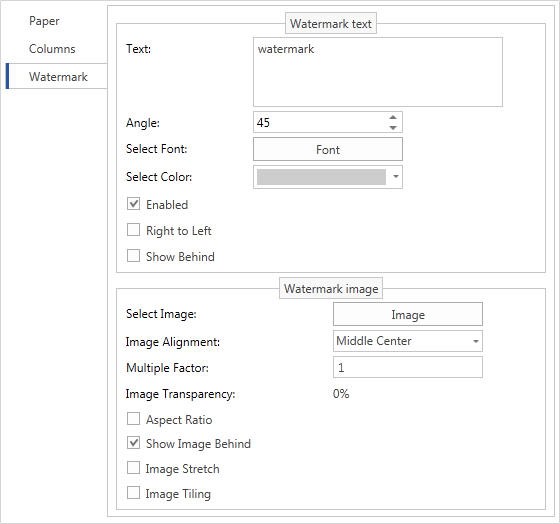

## Watermark Property

The Watermark property allows user to output one image and one inscription on the background or foreground. The Watermark property has sub-properties to output watermarks.

On the table below Text properties for watermark are described.

| **Properties** | **Description** |
| --- | --- |
| Text | A text that is used to output a watermark |
| Text Brush | A brush to output a watermark |
| Font | A font that is used to output a watermark |
| Angle | An angle to rotate a watermark |
| ShowBehind | Show text of a watermark on the background or foreground |

An example how properties can be used is shown on the picture below.

On the table below Image properties for watermark are described.

| Properties | **Description** |
| --- | --- |
| Image | An image to output |
| ImageAlignment | This property is used to align an image on a page |
| ImageMultipleFactor | A multiplier that is used to change image size |
| AspectRatio | Saves proportions of an image |
| ImageTiling | If to set this property to true, then it will be tiled throughout a page |
| ImageTransparency | This property is used to set image transparency |
| ImageStretch | Stretches an image on a page |
| ShowImageBehind | Shows an image of a watermark on the background or foreground |

Also there is another Enabled property. This property enables or disables watermark output.
