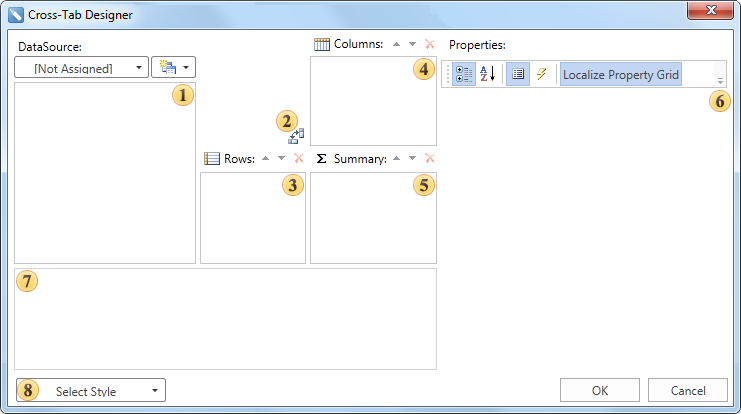

## Wizard Cross-Tab

The **Cross-Tab** wizard is used to create reports with cross-tab. The picture below shows the window of the **Cross-Tab** wizard.

 **Data Source Panel**. In the **Data Source** field it is necessary to select the data source. Then data source columns will be shown on the panel of the data source.

 The **Swap Rows/Columns** button is used to change data between columns, which are placed on the **Rows** and **Columns** panels.

 The **Rows** panel shows data source columns, which are rows of a cross table.

 The **Columns** panels shows data source columns, which are columns of a cross table.

 The **Summary** shows data source columns, which are the key column and row in the cross table. Key column and row generate summary cell.

 The **Properties** panel shows a table of properties of selected column of the data source.

 The **Preview Panel** is used to preview the template of a cross table.

 The **Select Style** button is used to select style of the cross table appearance.
