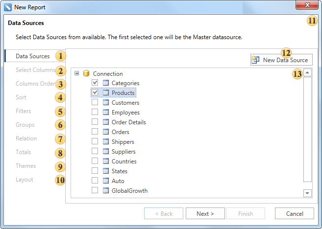
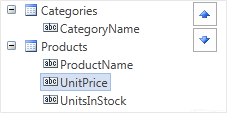

## Wizard Master-Detail Report

| Important |
| --- |
| Scripts can be a security risk, so they are disabled in the [Interpretation mode](../../Template/Calculation_Mode.md). However, if you are confident in the safety of your scripts, you can use them in the [Compilation mode](../../Template/Calculation_Mode.md). |

The **Master-Detail** report can be created using the **Master-Detail Report** report wizard. The picture below shows a window of the **Master-Detail Report** wizard:

 **Data Source**. On this step the data source is defined. This step is obligatory. For creating the **Master-Detail Report**, the report template should have no less than one **Master** band and one **Detail** band.

 **Select Columns**. On this step columns of a data source are selected. This step is obligatory.

 **Columns Order**. This step defines the order of columns. Data columns selected in the second stage will be shown as a list on the **Selection Parameters Panel**. The top-down order of columns shown in the panel corresponds to their left-to-right position in a report. It is possible to change the position of data columns by dragging them or by clicking the buttons on the control panel of this step. The picture below shows the order of columns on the **Selection Parameters Panel**:

 **Groups**. This step defines the condition of grouping. It is necessary to select a data column by what conditions of grouping will be created.

 **Relation**. defines the relation between **Master** and **Detail** bands. The relation is used for selecting detail data only for the specified **Master** band row. If a relation will not be specified then all **Details** data rows will be output for each row of the **Master** band. Selection is done between relations which are created between **Master** and **Detail** data sources, and where a **Detail** data source is a detail data source. More than one relation can be. So it is necessary to select the correct relation.

 **Totals**. On this step, it is possible to select a function for calculating totals by any data source column. For each data column its own function of aggregation can be set.

 **Themes**. This step defines the report style.

 **Layout**. On this step, the basic report options are set. Among them are: page **Orientation**, script **Language**, a **Component** that will be used for report rendering (DataBand or Table), report **Units**.

 The **Description Panel**. Shows description for the current step.

 The **New Data Source** button is used to create a new data source.

 The **Selection Parameters** **Panel** shows options, actions, settings available on this step.
