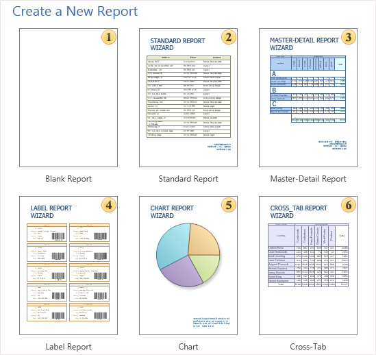
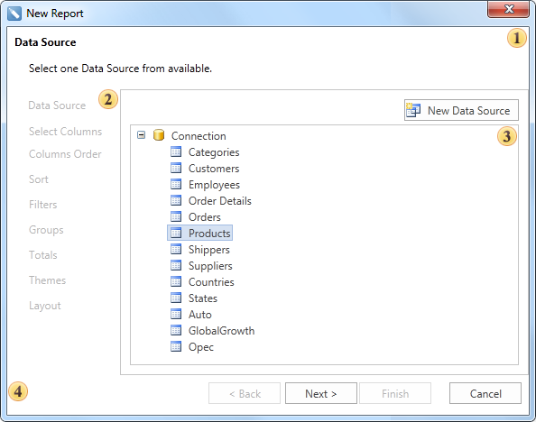

## Overview

When creating a new report in the **New Report** dialog you should choose a way to create a report. The picture below shows the **Create a New Report** dialog:

As can be seen from the picture above, there are several ways of creating a report: select a **Blank Report**, and manually create a report template, or create a report using the report wizards.

* The **Blank Report** icon can be used to create a blank report and the user should put components manually.

* The **Standard Report** wizard is used to create reports as a list.

* The **Master-Detail Report** wizard is used to create a **Master-Detail** reports.

* The **Label Report** wizard is used to create Label reports.

* The **Chart** wizard is used to create reports with charts.

* The **Cross-Tab** wizard is used to create Cross-Tab reports.

Any **Report Wizard** has the following panels: **Description Panel**, **Steps Panel**, **Selection Parameters Panel**, **Control Panel**. The picture below shows the **Standard Report** wizard:

 The **Description Panel**. This panel shows description of each steps to be done.

 The **Steps Panel**. Shows steps of creating reports using a report wizard.

 The **Selection Parameters Panel**. This panel shows report parameters. On each step of report creation its own options are available.

 The **Control Panel**. Contains buttons to control the **Report Wizard**.
